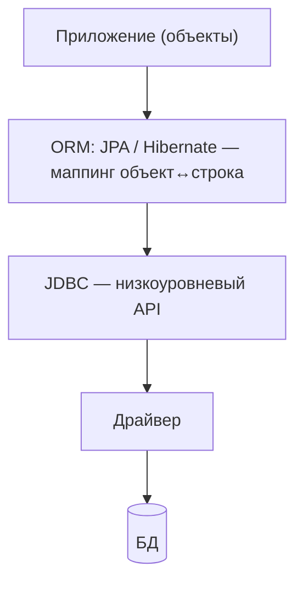

# JDBC vs ORM

Частый вопрос: чем работа через **JDBC** отличается от **ORM** (JPA/Hibernate) и что
когда выбирать? Главное понять: это не «или-или» на одном уровне — **ORM построен
поверх JDBC**. Разберём разницу и компромиссы.

## ORM работает поверх JDBC

ORM (Object-Relational Mapping) — это отображение объектов Java на строки таблиц.
Hibernate не общается с БД напрямую: он генерирует SQL и выполняет его **через тот же
JDBC**. То есть JDBC — фундамент, ORM — удобная надстройка над ним.



## В чём разница на практике

**JDBC** — пишешь SQL сам и вручную перекладываешь `ResultSet` в объекты:

```java
// JDBC: всё руками
PreparedStatement ps = conn.prepareStatement("SELECT id, name FROM users WHERE id = ?");
ps.setLong(1, id);
ResultSet rs = ps.executeQuery();
User u = null;
if (rs.next()) {
    u = new User(rs.getLong("id"), rs.getString("name"));   // ручной маппинг
}
```

**ORM** — описываешь сущность аннотациями, а загрузку/сохранение и маппинг делает
Hibernate:

```java
// ORM: маппинг делает Hibernate
User u = repository.findById(id).orElseThrow();   // SQL и маппинг — под капотом
```

## Сравнение

| | JDBC | ORM (JPA/Hibernate) |
|---|---|---|
| Уровень | низкий, «ближе к БД» | высокий, «ближе к объектам» |
| Кто пишет SQL | ты сам | генерирует ORM (можно и свой) |
| Маппинг в объекты | вручную | автоматически |
| Объём кода | много рутины | мало для типовых операций |
| Контроль над SQL | полный | меньше (SQL скрыт) |
| Кривая обучения | простой в основе | сложнее (контекст, LAZY, кэши) |
| Скрытые ловушки | почти нет | N+1, LazyInitializationException |
| Переносимость между БД | ниже (SQL руками) | выше (ORM генерирует под диалект) |

## Плюсы и минусы

**JDBC:**

- ➕ полный контроль над SQL, предсказуемость, ничего «магического»; хорош для сложных
  запросов и максимальной производительности;
- ➖ много ручного кода (маппинг, ресурсы), легко ошибиться, дольше разрабатывать.

**ORM:**

- ➕ мало кода для типовых CRUD-операций, автоматический маппинг, кэширование,
  переносимость, dirty checking;
- ➖ «магия» под капотом: не понимая её, легко словить [N+1](../../top-questions/jpa/n-plus-1.md),
  `LazyInitializationException`, лишние запросы; сложнее контролировать точный SQL.

## Промежуточные варианты

Есть инструменты «между» голым JDBC и полным ORM:

- **Spring `JdbcTemplate`** — убирает рутину JDBC (открытие/закрытие, обработку
  ошибок), но SQL ты пишешь сам. Компромисс: контроль JDBC без boilerplate.
- **Spring Data JDBC** — лёгкий маппинг без сложностей Hibernate (нет Persistence
  Context, LAZY).
- **MyBatis / JOOQ** — SQL под контролем + удобный маппинг.

## Когда что выбирать

- **ORM (JPA/Hibernate)** — по умолчанию для типовых приложений с CRUD и понятной
  доменной моделью: быстро, мало кода.
- **JDBC / `JdbcTemplate` / JOOQ** — когда нужен **точный контроль над SQL**: тяжёлые
  отчётные запросы, сложные джойны, оптимизация производительности, работа с фичами
  конкретной СУБД.
- На практике часто **комбинируют**: основной CRUD — через ORM, а пара «тяжёлых»
  запросов — через `JdbcTemplate` или нативный SQL.

## Как ответить на интервью

Коротко: ORM (JPA/Hibernate) — это надстройка **поверх** JDBC, а не альтернатива на
том же уровне: Hibernate всё равно ходит в БД через JDBC. Разница в уровне абстракции.
JDBC — низкоуровневый: сам пишешь SQL и вручную перекладываешь `ResultSet` в объекты,
полный контроль, но много рутины. ORM — маппинг объект↔строка делается автоматически,
кода мало, есть кэш и переносимость, но появляется «магия» и её ловушки (N+1,
LazyInitializationException). Выбор: для типового CRUD — ORM (быстро), для сложных и
производительных запросов — JDBC/`JdbcTemplate`/JOOQ; часто их комбинируют. Между ними
есть промежуточные варианты — `JdbcTemplate`, Spring Data JDBC, MyBatis, JOOQ.
