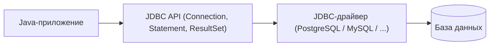
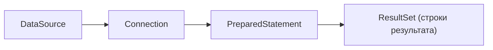

# Что такое JDBC

**JDBC (Java Database Connectivity)** — стандартный **низкоуровневый API** для работы с
реляционной базой данных из Java. Это тот самый базовый слой, через который в конечном
счёте ходят в БД все остальные инструменты — и Spring, и Hibernate. Понимать JDBC
важно, потому что ORM (JPA/Hibernate) — это надстройка **поверх** него.

## Идея: единый интерфейс к разным БД

JDBC задаёт набор интерфейсов (`Connection`, `Statement`, `ResultSet`), а конкретную
реализацию под свою СУБД поставляет **драйвер** — отдельная библиотека (например,
драйвер PostgreSQL). Приложение работает с одинаковым API, а драйвер переводит вызовы
в «язык» конкретной базы. Сменить БД — сменить драйвер, код почти не меняется.



## Основные объекты

Работа с JDBC — это цепочка из нескольких объектов:

- **`DataSource` / `DriverManager`** — источник соединений. `DriverManager` — старый
  способ получить соединение напрямую; на практике используют `DataSource` (обычно с
  пулом соединений).
- **`Connection`** — соединение с БД. Через него открывают запросы и управляют
  транзакцией.
- **`Statement` / `PreparedStatement`** — сам SQL-запрос. `Statement` — простой
  запрос; **`PreparedStatement`** — запрос с параметрами (`?`), его и используют почти
  всегда.
- **`ResultSet`** — результат `SELECT`: курсор по строкам, который читают построчно.



## Как выглядит на практике

```java
String sql = "SELECT id, name FROM users WHERE age > ?";

try (Connection conn = dataSource.getConnection();
     PreparedStatement ps = conn.prepareStatement(sql)) {

    ps.setInt(1, 18);                       // подставили параметр

    try (ResultSet rs = ps.executeQuery()) {
        while (rs.next()) {                 // идём по строкам
            long id = rs.getLong("id");
            String name = rs.getString("name");
            // ... собираем объект вручную
        }
    }
}
```

Здесь видно ключевую особенность JDBC: **всё вручную** — открыть соединение, задать
параметры, пройти по `ResultSet`, самому переложить колонки в поля объекта. Это даёт
полный контроль, но это много рутинного кода.

## `PreparedStatement` и защита от инъекций

Параметры передаются через `?` **отдельно** от текста запроса, поэтому пользовательский
ввод не может «вклиниться» в SQL — это защита от [SQL-инъекций](../../top-questions/security/web-attacks.md).
Плюс СУБД может переиспользовать план запроса. Правило: **не склеивать** ввод в строку
SQL, всегда использовать параметры.

## Транзакции в JDBC

По умолчанию каждый запрос коммитится сам (**auto-commit**). Чтобы объединить
несколько запросов в одну транзакцию, авто-коммит выключают и управляют вручную:

```java
conn.setAutoCommit(false);
try {
    // несколько запросов...
    conn.commit();        // всё удачно — фиксируем
} catch (Exception e) {
    conn.rollback();      // ошибка — откатываем всё
}
```

Именно это делает за тебя Spring, когда ты ставишь `@Transactional`.

## Пул соединений

Открывать новое соединение с БД на каждый запрос **дорого** (сеть, аутентификация).
Поэтому используют **пул соединений** (например, **HikariCP**, по умолчанию в Spring
Boot): заранее созданные соединения переиспользуются. `dataSource.getConnection()`
берёт готовое из пула, а `close()` не рвёт его, а **возвращает** в пул.

## Закрытие ресурсов

`Connection`, `Statement`, `ResultSet` нужно **обязательно закрывать**, иначе
соединения утекут и пул исчерпается. Поэтому их открывают в **try-with-resources**
(как в примере выше) — ресурсы закроются автоматически.

## Как ответить на интервью

Коротко: JDBC — стандартный низкоуровневый API Java для работы с реляционной БД. Он
задаёт интерфейсы (`Connection`, `PreparedStatement`, `ResultSet`), а конкретный
**драйвер** реализует их под свою СУБД. Работа идёт по цепочке: из `DataSource` берём
`Connection`, на нём создаём `PreparedStatement` с параметрами через `?` (это же
защита от инъекций), выполняем и построчно читаем `ResultSet`, вручную перекладывая
колонки в объекты. Транзакции — через `setAutoCommit(false)` + `commit`/`rollback`.
Соединения дорогие, поэтому берутся из **пула** (HikariCP), а ресурсы закрывают через
try-with-resources. Главное — JDBC даёт полный контроль, но требует много ручного
кода; ORM (Hibernate) — это надстройка поверх JDBC, которая эту рутину убирает.
