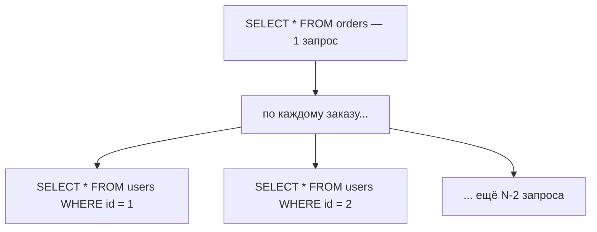

# Ленивая загрузка и N+1

Это самая частая проблема Hibernate и почти обязательный вопрос на собесе.
Понять её — значит понять, как ленивые связи превращаются в лавину запросов.

## Ленивая загрузка

При `LAZY` связь не грузится вместе с сущностью — вместо реального объекта
Hibernate подставляет **прокси**. Как только код обращается к полю
(`order.getUser().getName()`), прокси идёт в базу отдельным запросом и
подгружает данные. Пока не обратился — запроса нет.

Отсюда два следствия — одно хорошее (не грузим лишнее), два плохих:

- **`LazyInitializationException`** — если обратиться к ленивой связи, когда
  persistence context уже закрыт (сущность detached, транзакция завершилась).
  Классика: вернули сущность в контроллер, там сериализуют в JSON, дошли до
  ленивого поля — а транзакции уже нет.
- **N+1** — см. ниже.

## Проблема N+1

Загружаем список из N сущностей, потом у каждой обращаемся к ленивой связи:

```java
List<Order> orders = orderRepo.findAll();     // 1 запрос: SELECT * FROM orders
for (Order o : orders) {
    System.out.println(o.getUser().getName()); // +1 запрос на КАЖДЫЙ заказ
}
```

Получается **1** запрос за списком + **N** запросов за связями = N+1 запросов
к базе. На 200 заказах — 201 запрос вместо одного. Приложение работает
(и потому баг незаметен), но медленно, и тем хуже, чем больше данных.



## Как обнаружить

N+1 не виден глазами — его надо ловить:

- Включить лог SQL Hibernate и посмотреть число запросов на одну операцию.
- Счётчик запросов в метриках / тест, проверяющий количество обращений к БД
  (`datasource-proxy`, Hibernate statistics).

## Как лечить

- **`JOIN FETCH` в JPQL** — забрать связь одним запросом с join:
  `SELECT o FROM Order o JOIN FETCH o.user`. Основной инструмент.
- **`@EntityGraph`** на методе репозитория — то же декларативно, без ручного
  JPQL.
- **`@BatchSize(size = N)`** — не убирает N+1, но схлопывает N запросов в
  N/размер: Hibernate грузит связи пачками через `IN (...)`. Хорошо для
  коллекций.
- **Проекция/DTO** — если нужны 2-3 поля, вообще не грузить сущности, а
  выбрать нужное запросом сразу в DTO.

## Чего НЕ делать

**Не ставить `EAGER`** как «решение». Это не убирает проблему, а делает её
постоянной: связь теперь грузится всегда, в том числе там, где не нужна, и
`JOIN FETCH` коллекций с EAGER легко даёт декартово произведение. Правильно —
`LAZY` везде + явная загрузка там, где связь реально используется.

Про `open-session-in-view`: в Spring Boot он **включён по умолчанию** и держит
persistence context открытым до конца HTTP-запроса, отчего
`LazyInitializationException` не возникает. Но это маскировка: ленивые связи
инициализируются уже в слое представления, порождая тот же N+1. Осознанный
подход — собирать DTO внутри транзакции, а OSIV выключать.

## Как ответить на интервью

Коротко: при `LAZY` Hibernate подставляет прокси и грузит связь при первом
обращении отдельным запросом. Если обратиться к списку из N сущностей и у
каждой дёрнуть ленивую связь — 1 запрос за списком + N за связями = N+1,
приложение работает, но медленно. Ловлю логом SQL/счётчиком запросов. Лечу
`JOIN FETCH` или `@EntityGraph` (одним запросом), `@BatchSize` (пачками),
проекцией в DTO. `EAGER` — не решение, а перенос проблемы; `open-session-in-
view` её маскирует. Ещё побочный эффект ленивости — `LazyInitializationException`
при обращении вне транзакции, лечится тем же: не тащить сущности наружу, а
отдавать DTO.
