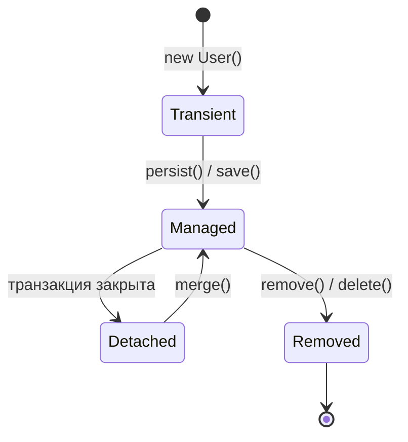

# Persistence context

Persistence context — сердце JPA/Hibernate. Это область в памяти, где живут
**управляемые (managed)** сущности в пределах одной транзакции. Понимание его
работы объясняет большинство «магии» Hibernate: почему изменение поля
сохраняется без `save`, почему бывают неожиданные запросы, что такое N+1.

Технически persistence context привязан к `EntityManager` (в Hibernate —
`Session`), а тот в Spring живёт в рамках транзакции.

## Состояния сущности



- **Transient** — новый объект (`new`), JPA о нём не знает.
- **Managed** — под управлением persistence context (после `persist`/`find`);
  все изменения полей отслеживаются.
- **Detached** — сущность была managed, но контекст закрылся (транзакция
  завершилась); изменения больше не отслеживаются.
- **Removed** — помечена на удаление.

## Три ключевых механизма

### Dirty checking (автосохранение изменений)

Пока сущность managed, менять её через `setX(...)` достаточно — **`save`
вызывать не нужно**. На коммите Hibernate сравнивает текущее состояние с
исходным снимком и сам генерирует `UPDATE` для изменённых полей.

```java
@Transactional
public void rename(Long id, String name) {
    User u = repo.findById(id).orElseThrow();  // managed
    u.setName(name);                            // просто меняем поле
}   // на коммите Hibernate сам сделает UPDATE
```

Это часто удивляет новичков: «я не звал save, а в базе изменилось».

### First-level cache (кэш первого уровня)

В пределах транзакции persistence context — это кэш по id: повторный
`findById` того же id **не идёт в базу**, возвращается тот же объект. Гарантия:
в одной транзакции одна строка = один объект в памяти (identity).

### Flush

**Flush** — момент, когда накопленные изменения выгружаются в БД как SQL.
Происходит автоматически: перед `COMMIT`, а также перед выполнением запроса,
который может зависеть от несохранённых изменений. Важно: flush ≠ commit —
SQL ушёл в базу, но транзакция ещё не зафиксирована и может откатиться.

## Почему это важно на практике

- **Транзакция должна быть открыта**, пока работаешь с сущностью. Вышла за
  границу транзакции (например, в контроллер) — сущность detached, обращение
  к ленивым связям падает `LazyInitializationException`.
- **Не держи в persistence context тысячи сущностей** — dirty checking и кэш
  первого уровня растут, память и время flush тоже. Для пакетной обработки —
  периодический `flush()` + `clear()`.
- Понимание flush объясняет, почему иногда запросы уходят в базу «не там, где
  ждёшь».

## Пул соединений — смежная тема

Persistence context работает поверх **соединения с БД**, которое берётся из
пула (в Spring Boot — **HikariCP**). Транзакция удерживает соединение из пула
на всё своё время. Отсюда прямая связь: долгие транзакции = удержанные
соединения = исчерпание пула (см. вопрос про пул в конце подборки).

## Как ответить на интервью

Коротко: persistence context — область управляемых сущностей в пределах
транзакции. Даёт три вещи: dirty checking (меняешь поле managed-сущности — на
коммите Hibernate сам делает `UPDATE`, без `save`), кэш первого уровня
(повторный `findById` не идёт в базу, одна строка = один объект), и flush
(выгрузка накопленных изменений в SQL перед коммитом/запросом). Сущность
живёт managed только внутри транзакции; вышла за неё — detached, ленивые
связи падают. И контекст нельзя раздувать тысячами сущностей — для батчей
`flush`+`clear`.
