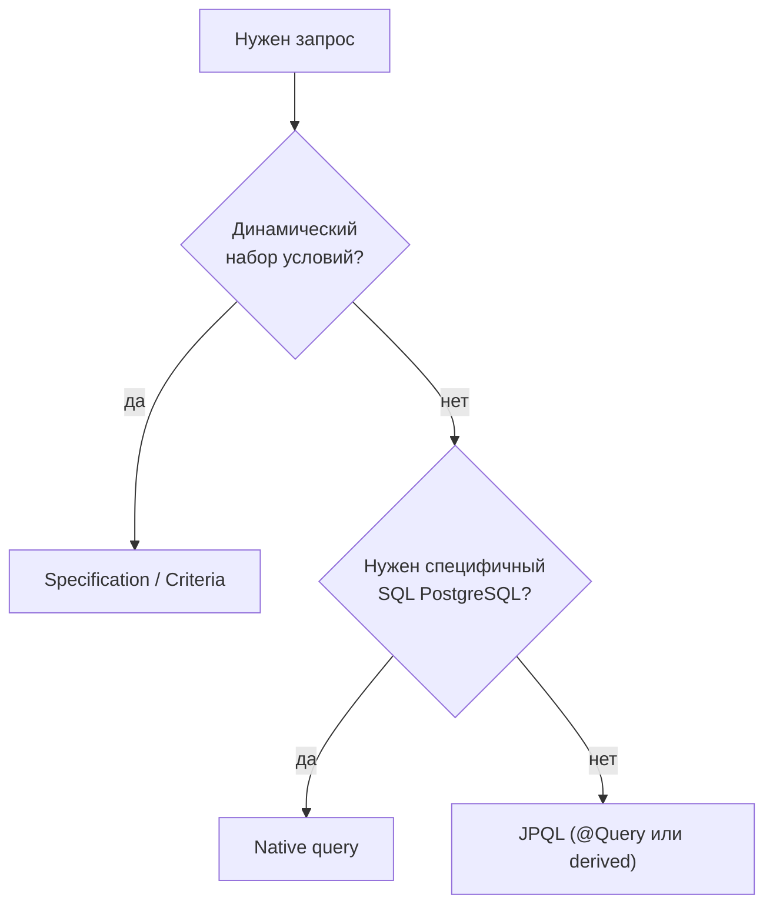

# Запросы

Кроме поиска по id, JPA/Hibernate предлагают несколько способов писать
запросы. Важно понимать разницу между ними и когда какой уместен.

## JPQL

**JPQL** (Java Persistence Query Language) — язык запросов JPA. Похож на SQL,
но оперирует **сущностями и их полями**, а не таблицами и столбцами:

```java
@Query("SELECT o FROM Order o WHERE o.status = :status AND o.user.email = :email")
List<Order> findByStatusAndEmail(@Param("status") Status s, @Param("email") String email);
```

`Order`, `o.user.email` — это классы и поля, Hibernate транслирует их в SQL с
нужными таблицами и join. JPQL переносим между СУБД и знает про связи.
`JOIN FETCH` в JPQL — способ решить N+1 (см. соответствующую тему).

## Native query

Когда нужен специфичный для PostgreSQL SQL (оконные функции, `ON CONFLICT`,
CTE, работа с `jsonb`) — нативный запрос:

```java
@Query(value = "SELECT * FROM orders WHERE created_at > now() - interval '1 day'",
       nativeQuery = true)
List<Order> recent();
```

Плата — теряется переносимость, и запрос не знает про сущности так, как JPQL.
Используем осознанно, ради возможностей конкретной БД.

## Criteria API

Программное построение запроса объектами Java. Многословно, но незаменимо для
**динамических** запросов, где набор условий зависит от ввода (фильтры с
опциональными полями). В Spring Data для этого удобнее **Specification** —
обёртка над Criteria (см. раздел про Spring Data JPA).

## Проекции: не тащить сущности целиком

Если нужны не все поля, а два-три, грузить сущность расточительно. Проекция
выбирает сразу нужное:

- **Интерфейс-проекция** (Spring Data): объявляешь интерфейс с геттерами —
  Hibernate вернёт только эти столбцы.
- **DTO-проекция**: `SELECT new com.app.OrderView(o.id, o.status) FROM Order o`
  — сразу в конструктор DTO.

Проекции полезны и для производительности (меньше данных, возможен index-only
scan), и как способ **не выносить сущность за транзакцию** — DTO безопасно
отдавать наружу, в отличие от managed-сущности с ленивыми связями.

## Что выбрать



- **Derived query** (`findByStatus`) — для простого.
- **JPQL** — для большинства осмысленных запросов со связями.
- **Native** — когда нужны фичи конкретной СУБД.
- **Specification/Criteria** — динамические фильтры.
- **Проекция/DTO** — когда не нужны все поля или результат уходит наружу.

## Как ответить на интервью

Коротко: JPQL — язык запросов по сущностям и полям, переносим и знает про
связи (там же `JOIN FETCH` против N+1). Native query — когда нужен SQL под
конкретную СУБД (оконные функции, `jsonb`), ценой переносимости. Criteria/
Specification — для динамических фильтров, собираемых из кода. А если нужны не
все поля — проекция или DTO: меньше данных и безопасно отдавать наружу, не
вынося managed-сущность за транзакцию.
