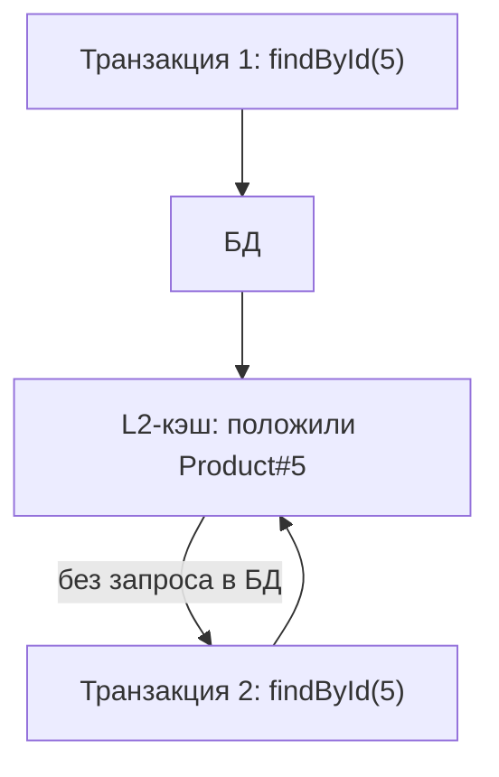

# Кэш второго уровня

У Hibernate два кэша, и их важно не путать:

- **Кэш первого уровня (L1)** — persistence context, живёт в пределах **одной
  транзакции**, работает всегда и бесплатно (см. тему про persistence context).
- **Кэш второго уровня (L2)** — общий кэш на **всё приложение**, переживает
  транзакции, выключен по умолчанию и включается осознанно.

## Что такое L2

L2 хранит данные сущностей между транзакциями, чтобы повторные загрузки по id
не шли в базу. Технически это отдельный кэш-провайдер (Ehcache, Caffeine,
Hazelcast), подключаемый к Hibernate; сущности помечаются `@Cacheable` +
`@Cache`.

Отдельно есть **query cache** — кэш результатов запросов (списков id по
условию); включается отдельно и капризнее.

## Когда уместен

- Данные **часто читаются и редко меняются**: справочники, категории,
  настройки, курсы. Тогда L2 экономит много запросов.
- Не подходит для часто меняющихся данных: кэш придётся постоянно
  инвалидировать, выгода теряется, а риск отдать устаревшее растёт.

## Почему на практике его часто НЕ используют

Важный для собеседования момент — честный:

- **Инвалидация сложна.** Если данные меняет **не только это приложение**
  (другой сервис, ручной `UPDATE` в базе, миграция), Hibernate об этом не
  знает и L2 отдаёт устаревшее. L2 надёжен, только когда БД пишет **одно**
  приложение.
- **В распределённой системе** (несколько инстансов) локальный L2 у каждого
  свой — они расходятся; нужен распределённый кэш, что усложняет.
- **Чаще берут внешний кэш (Redis) на уровне приложения** — им проще
  управлять, он общий для инстансов и не завязан на жизненный цикл сущностей
  Hibernate.

Поэтому типичный ответ: L2 существует и полезен для редко меняющихся
справочников в приложении-единственном-писателе, но в микросервисной
реальности чаще кэшируют явно через Redis/`@Cacheable` Spring, а не L2.

## Как ответить на интервью

Коротко: L1 — persistence context, в пределах транзакции, всегда включён; L2
— общий кэш на всё приложение, между транзакциями, по умолчанию выключен,
подключается провайдером и `@Cache`. L2 уместен для часто читаемых и редко
меняемых данных (справочники). Но у него слабое место — инвалидация: если
базу меняет кто-то ещё, кэш отдаёт устаревшее, а в нескольких инстансах
локальные L2 расходятся. Поэтому на практике чаще кэшируют явно через Redis/
Spring `@Cacheable`, чем полагаются на L2.
