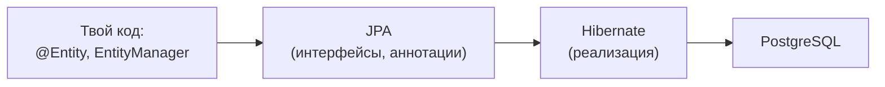

# Что такое JPA и ORM

**ORM** (Object-Relational Mapping) — подход, при котором строки таблиц
отображаются на объекты классов, и работа с базой ведётся через объекты, а не
через SQL руками. **JPA** (Jakarta Persistence API) — стандарт ORM для Java:
набор интерфейсов и аннотаций. **Hibernate** — самая распространённая
реализация этого стандарта (есть и другие — EclipseLink).

То есть: JPA — спецификация (что), Hibernate — реализация (как). Пишешь код
против JPA, под капотом работает Hibernate.

## Зачем ORM

Без ORM на каждую операцию пишут SQL и вручную перекладывают
`ResultSet` в объекты — много однообразного кода. ORM это убирает:
`repository.save(user)` вместо `INSERT`, `findById` вместо `SELECT`. Плюс —
переносимость между СУБД, кэширование, управление транзакциями.

## Чем платим — важно понимать

ORM — удобная абстракция, но **дырявая**: SQL никуда не делся, он
генерируется, и непонимание того, какой SQL уходит в базу, порождает главные
проблемы:

- **N+1 запросов** — вместо одного `JOIN` Hibernate делает лавину мелких
  запросов (см. отдельную тему). Самая частая беда.
- **Скрытые запросы** — обращение к ленивому полю молча идёт в базу.
- **Ощущение, что SQL не нужен** — обманчиво: чтобы готовить ORM, надо
  понимать SQL и уметь смотреть, что он реально шлёт.

Правильная позиция для собеседования: ORM убирает рутину, но не освобождает
от понимания SQL — наоборот, требует его, чтобы не выстрелить себе в ногу.

## Ключевые понятия

- **`@Entity`** — класс, отображённый на таблицу; его экземпляр = строка.
- **`EntityManager`** — главный рабочий интерфейс JPA: сохранить, найти,
  удалить, выполнить запрос. Spring Data JPA — это ещё одна надстройка
  **над** JPA/Hibernate, которая генерирует репозитории (см. раздел про
  Spring Data JPA); сам JPA ниже.
- **Persistence context** — «кэш» управляемых сущностей в пределах
  транзакции, сердце Hibernate (см. отдельную тему).

## Как ответить на интервью

Коротко: ORM отображает строки таблиц на объекты, чтобы работать с базой
через объекты, а не через ручной SQL. JPA — стандарт (интерфейсы и
аннотации), Hibernate — его основная реализация; пишешь против JPA, работает
Hibernate. Даёт меньше рутинного кода, кэш, переносимость. Но абстракция
дырявая: SQL генерируется, и без понимания, какой именно, получаешь N+1 и
скрытые запросы. Поэтому ORM не отменяет знание SQL, а требует его.
