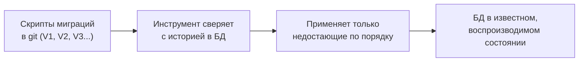

# Зачем нужны миграции

Схема базы — таблицы, столбцы, индексы, ограничения — меняется вместе с кодом:
добавили поле, завели таблицу, поменяли тип. Миграции — способ управлять этими
изменениями так же дисциплинированно, как кодом: версионированно,
воспроизводимо, в git.

## Проблема без миграций

Если менять схему руками (`ALTER TABLE` в консоли на каждом окружении),
возникает хаос:

- Схема на dev, staging и prod **расходится** — где-то поле добавили, где-то
  забыли.
- Непонятно, **в каком состоянии** база и какие изменения уже применены.
- Новый разработчик не может поднять актуальную базу с нуля.
- Изменение схемы не связано с кодом, который на него рассчитывает.

## Как решают миграции

Каждое изменение схемы — отдельный **скрипт миграции**, лежащий в репозитории
рядом с кодом. Инструмент (Flyway/Liquibase) хранит в служебной таблице
(`flyway_schema_history`), какие миграции уже применены к этой базе, и при
старте **накатывает недостающие** по порядку.

Что это даёт:

- **Воспроизводимость** — любую базу (новую, тестовую, prod) можно привести к
  нужной версии одними и теми же скриптами.
- **Версионирование** — история изменений схемы в git, рядом с кодом, который
  их требует.
- **Автоматизация** — миграции применяются в CI/CD и при старте приложения,
  без ручных `ALTER` на проде.

## Ключевые принципы

- **Миграции неизменяемы.** Применённый скрипт **не редактируют** — Flyway
  хранит его контрольную сумму и упадёт, если файл изменили. Нужна правка —
  новая миграция.
- **Только вперёд (forward-only) на практике.** Откат схемы назад в проде
  опасен (down-скрипт может потерять данные), поэтому проблему чаще чинят
  новой миграцией-исправлением, а не откатом.
- **Миграции совместимы с кодом обеих версий** при выкатке — об этом отдельная
  тема «Миграции на живой базе».

## Как ответить на интервью

Коротко: схема меняется вместе с кодом, и миграции управляют этим как кодом —
каждое изменение отдельным версионированным скриптом в git. Инструмент
(Flyway/Liquibase) хранит историю применённого в служебной таблице и при
старте накатывает недостающее по порядку. Это даёт воспроизводимость (любую
базу привести к нужной версии), версионирование и автоматизацию вместо ручных
`ALTER` на проде. Применённые миграции не редактируют (только новая правящая),
а откат назад в проде обычно заменяют forward-фиксом.
