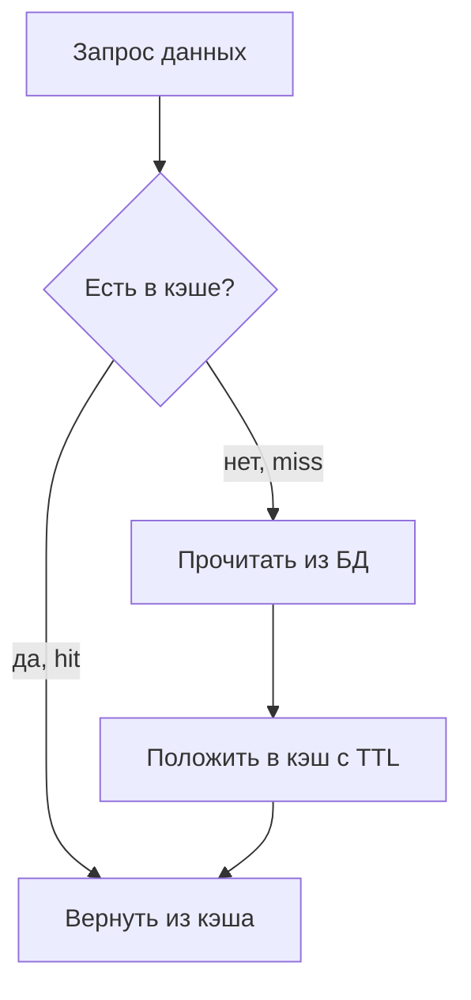

# Кэширование: стратегии

Кэш хранит копию данных ближе и быстрее, чтобы не ходить каждый раз в
медленную базу. Главные вопросы кэширования — **как данные попадают в кэш** и
**как обновляются**. Отсюда стратегии.

## Cache-aside (lazy loading) — основная

Самая частая стратегия. Кэшем управляет **приложение**:

- Чтение: смотрим в кэш; **hit** — вернули; **miss** — читаем из БД, кладём
  в кэш, возвращаем.
- Запись: пишем в БД и **инвалидируем** (удаляем) ключ в кэше, чтобы
  следующее чтение подтянуло свежее.

Плюсы: в кэше только то, что реально запрашивают; кэш падает — приложение
работает (просто медленнее). Минус: первый запрос всегда miss; возможна
рассинхронизация (см. тему про проблемы кэширования).

## Другие стратегии — коротко

- **Read-through / Write-through** — кэш сам ходит в БД (за него это делает
  библиотека). Write-through пишет **синхронно** и в кэш, и в БД — данные
  согласованы, но запись медленнее.
- **Write-behind (write-back)** — пишем в кэш, а в БД сбрасываем **асинхронно**
  пачкой. Очень быстрая запись, но риск потерять данные при падении до сброса.
- **Write-around** — пишем только в БД, минуя кэш; кэш наполняется при чтении.
  Хорошо, когда записанное редко сразу читают.

Для собеседования достаточно уверенно описать **cache-aside** (дефолт) и
понимать, чем отличается write-through (согласованность ценой скорости) и
write-behind (скорость ценой риска).

## TTL — обязателен

Почти всегда ключам ставят **TTL** — время жизни. Зачем:

- **Страховка от рассинхронизации** — даже если инвалидацию где-то забыли,
  устаревшее само протухнет через TTL.
- **Контроль объёма** — старое вымывается, память не растёт бесконечно.

TTL выбирают по тому, насколько допустимо отдавать слегка устаревшее: каталог
— минуты/часы, курс валют — секунды. TTL — это осознанный размен свежести на
нагрузку.

## Что кэшировать

- **Часто читается, редко меняется** — идеальный кандидат (справочники,
  профили, каталог).
- Не кэшируют то, что меняется на каждый запрос или требует абсолютной
  свежести (баланс в момент списания).

## Как ответить на интервью

Коротко: основная стратегия — cache-aside: читаем из кэша, при промахе идём
в БД и кладём в кэш с TTL, при записи инвалидируем ключ. Она проста и
устойчива (кэш упал — работаем медленнее). Альтернативы: write-through
(синхронно в кэш и БД, согласованно но медленнее), write-behind (асинхронно
в БД, быстро но с риском потери). TTL ставим почти всегда — и как страховку
от забытой инвалидации, и для контроля памяти. Кэшируем то, что часто
читается и редко меняется.
