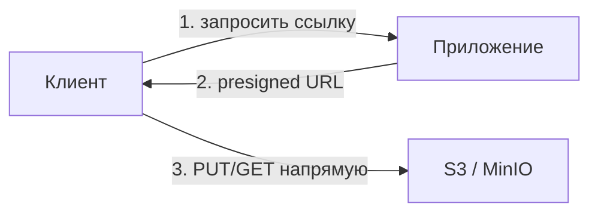

# Работа из приложения

Как приложение на Java/Spring загружает и отдаёт файлы через S3-совместимое
хранилище. Важнее конкретного API — понимать правильные схемы работы, потому
что наивный подход «файл проходит через приложение» плохо масштабируется.

## Клиент

Работают через **AWS SDK for Java (v2)** — `S3Client`. Он же ходит и в MinIO:
задаёшь endpoint, регион, ключи. В Spring клиент оформляют бином и настраивают
из конфигурации (endpoint/ключи — из секретов).

```java
s3.putObject(
    PutObjectRequest.builder().bucket("files").key("users/42/avatar.png").build(),
    RequestBody.fromBytes(data));

ResponseBytes<GetObjectResponse> obj = s3.getObjectAsBytes(
    GetObjectRequest.builder().bucket("files").key("users/42/avatar.png").build());
```

Базовые операции: `putObject` (загрузить), `getObject` (скачать),
`deleteObject`, `listObjectsV2` (по префиксу).

## Главный вопрос: как гонять байты

Есть две схемы, и правильный выбор — частая тема:

### Через приложение (proxy) — простой, но не масштабируемый

Клиент → приложение → S3 (и обратно). Приложение принимает файл целиком и
перекладывает в S3.

Проблемы: весь трафик файлов идёт через приложение — оно тратит память и
поток на каждую загрузку, большие файлы (видео) забивают heap, пропускная
способность приложения становится бутылочным горлышком.

### Напрямую через presigned URL — правильный для больших файлов

Приложение выдаёт клиенту **временную подписанную ссылку**, и клиент грузит/
скачивает файл **напрямую из S3**, минуя приложение (см. отдельную тему).
Приложение не пропускает байты через себя — только выдаёт ссылки.



## Потоковая загрузка

Если файл всё же идёт через приложение — **не читать его целиком в память**.
Большой `byte[]` на каждый запрос быстро валит heap. Работать потоком
(streaming), а для больших файлов — **multipart upload** (S3 умеет заливать
файл частями, докачивать и параллелить).

## Практические правила

- **Метаданные — в БД, файл — в S3.** В базе хранят ключ объекта, имя, размер,
  владельца, а сам байтовый контент — в хранилище. БД знает «где лежит», S3
  хранит «что лежит».
- **Ключи** проектируют осмысленно (`users/{id}/...`), часто с UUID, чтобы
  избегать коллизий и не выдавать структуру.
- **Согласованность**: файл в S3 и запись в БД — две разные системы; если
  запись в БД откатилась, а файл залит — останется «сирота». Продумывают
  порядок (сначала загрузка, потом запись; периодная уборка сирот).

## Как ответить на интервью

Коротко: работают через AWS SDK (`S3Client`, он же ходит в MinIO) — put/get/
delete/list. Главное — как гонять байты: наивно всё через приложение
(proxy) — просто, но приложение становится узким местом и рискует heap на
больших файлах; правильно для больших файлов — presigned URL: приложение
выдаёт временную ссылку, клиент грузит напрямую из S3, минуя сервис. Если файл
идёт через приложение — стримить, не читать целиком, для крупных — multipart
upload. И держать метаданные в БД, а сам файл в S3, помня, что это две системы
и бывают файлы-сироты.
