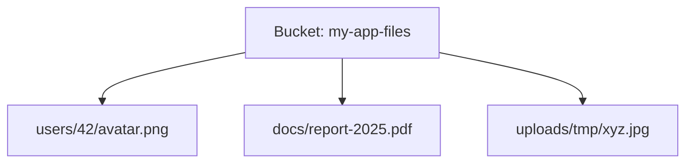

# Объектное хранилище

Объектное хранилище — способ хранить файлы (картинки, документы, видео,
бэкапы) как **объекты** в плоском пространстве, доступные по HTTP API. Это не
файловая система и не база — третий вид хранилища, оптимизированный под
большие объёмы неструктурированных данных.

## Три вида хранения — в чём разница

- **Блочное** — диск, разбитый на блоки (том, к которому монтируется ФС).
  Быстро, но привязано к машине.
- **Файловое** — привычная иерархия папок и файлов (NFS, сетевой диск).
- **Объектное** — файлы как объекты с уникальным ключом в «корзине», доступ
  по HTTP. Нет настоящих папок, огромная масштабируемость, доступ откуда
  угодно.

## Почему не хранить файлы в БД или на диске приложения

Частый вопрос «куда класть загруженные пользователем файлы» — и почему не
в привычные места:

- **В БД (BLOB)** — плохо: раздувает базу, тормозит бэкапы, дорогие операции,
  БД не для отдачи гигабайтов бинарников.
- **На локальный диск приложения** — плохо в облаке/кубере: инстансов
  несколько, диск у каждого свой (файл, загруженный на инстанс A, не виден
  на B), при перезапуске пода данные теряются (эфемерный диск).
- **Объектное хранилище** — правильное место: общее для всех инстансов,
  практически безграничное, с отдельным жизненным циклом от приложения.

## Модель данных

- **Bucket (корзина)** — контейнер верхнего уровня, глобально именованный.
- **Object (объект)** — сам файл + метаданные, лежит в корзине под уникальным
  **ключом**.
- **Ключ** выглядит как путь (`users/42/avatar.png`), но «папок» нет — это
  просто строка-ключ; префиксы имитируют иерархию.
- У каждого объекта — метаданные (тип содержимого, размер, свои заголовки) и
  права доступа.

## Ключевые свойства

- **Масштабируемость** — рассчитано на петабайты и миллиарды объектов.
- **Доступ по HTTP** — GET/PUT объекта, в том числе напрямую от клиента (см.
  presigned URL).
- **Классы хранения** — горячие/холодные/архивные с разной ценой и скоростью.
- **Versioning, lifecycle** — версии объектов, автоудаление старых по правилам.

## Как ответить на интервью

Коротко: объектное хранилище — третий вид хранения (наряду с блочным и
файловым) для файлов как объектов в корзинах, доступных по HTTP; заточено под
большие объёмы неструктурированных данных. Пользовательские файлы кладут
именно туда, а не в БД (раздувает базу, не для отдачи бинарников) и не на
локальный диск приложения (у каждого инстанса свой, теряется при рестарте).
Модель: bucket → object по уникальному ключу; «папки» — это префиксы в ключе,
настоящей иерархии нет. Плюс масштабируемость, версии и lifecycle-политики.
