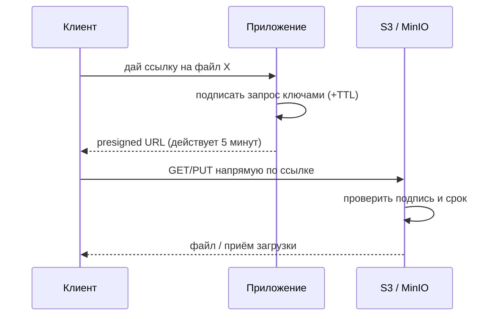

# Presigned URL

Presigned URL (предподписанная ссылка) — временная ссылка, дающая доступ к
конкретному объекту в приватном хранилище **без раскрытия ключей доступа**.
Это ответ на частый вопрос «как дать пользователю временный доступ к файлу».

## Задача

Файлы в хранилище **приватны** (публичный доступ открывать нельзя). Но
пользователю нужно скачать свой документ или загрузить аватар напрямую в S3.
Варианты «сделать бакет публичным» (небезопасно) и «гнать файл через
приложение» (не масштабируется) — плохи. Presigned URL решает это правильно.

## Как работает

Приложение (у которого есть Access/Secret Key) **подписывает** запрос к
конкретному объекту с ограниченным сроком и отдаёт клиенту готовую ссылку.
Клиент идёт по ней прямо в S3, минуя приложение. Подпись встроена в URL —
хранилище проверяет её и пускает.

Что зашито в ссылку и проверяется хранилищем:

- **конкретный объект и операция** (GET на скачивание или PUT на загрузку);
- **срок действия** (TTL, например 5–15 минут) — после истечения ссылка
  мертва;
- **подпись** ключами приложения — подделать нельзя, ключи в ссылку не
  попадают.

## Два направления

- **Presigned GET** — временная ссылка на **скачивание** приватного файла
  (отдать пользователю его документ, не открывая бакет).
- **Presigned PUT (upload)** — временная ссылка на **загрузку**: клиент
  заливает файл прямо в S3, приложение не пропускает байты через себя. Часто
  ограничивают размер/тип через политику.

## Почему это правильный подход

- **Безопасность** — бакет остаётся приватным, ключи не покидают сервер,
  доступ точечный (один объект) и временный.
- **Масштабируемость** — тяжёлый трафик файлов идёт напрямую клиент↔S3,
  приложение только выдаёт ссылки и не становится бутылочным горлышком.
- **Контроль** — приложение решает, кому и на что выдать ссылку (проверив
  права), и на какой срок.

## Нюансы

- **TTL — компромисс**: короткий безопаснее, но должен хватить на операцию
  (заливку большого файла).
- Выданную ссылку до истечения **нельзя отозвать** — поэтому срок короткий, а
  на приватные данные проверяют права **до** выдачи.
- Для загрузки размер/тип ограничивают на стороне политики, не доверяя
  клиенту.

## Как ответить на интервью

Коротко: presigned URL — временная подписанная ссылка на конкретный объект,
которую приложение генерирует своими ключами и отдаёт клиенту; тот идёт прямо
в S3, минуя сервис. В ссылке зашиты объект, операция (GET/PUT), срок и
подпись — ключи наружу не уходят, бакет остаётся приватным. Так дают временный
доступ на скачивание и приём прямых загрузок, не гоняя файлы через приложение
и не открывая хранилище публично. Права проверяют до выдачи, TTL короткий,
отозвать выданную ссылку нельзя.
