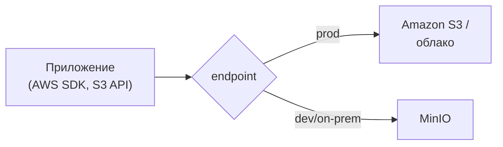

# S3 и MinIO

**S3** (Simple Storage Service) — объектное хранилище Amazon и одновременно
**де-факто стандарт API** для объектных хранилищ. **MinIO** — хранилище,
которое можно поднять у себя, полностью совместимое с S3 API. Ключевая мысль:
S3 API стал общим протоколом, и код почти не зависит от того, что за ним.

## S3 API как стандарт

Практическая ценность: S3 API поддерживает не только Amazon, а множество
хранилищ (MinIO, облака Yandex/VK/Google, Ceph). Пишешь код против S3 API
(через AWS SDK) — и он работает с любым из них, меняется только endpoint и
ключи. Это важно для банка/России: тот же код ходит в MinIO on-premise или в
S3-совместимое облако без переписывания.

## MinIO

MinIO — легковесное S3-совместимое хранилище с открытым кодом:

- **Self-hosted** — разворачивается в своей инфраструктуре (важно, когда
  данные нельзя отдавать во внешнее облако).
- **S3-совместимый API** — работает с тем же AWS SDK и инструментами, что и
  настоящий S3.
- **Удобен для разработки и тестов** — поднимается одним контейнером Docker,
  заменяет реальный S3 локально и в CI (в т.ч. через Testcontainers).

## Аутентификация и доступ

- **Access Key + Secret Key** — пара ключей, которой подписывается каждый
  запрос (подпись AWS Signature). Приложение хранит их в секретах, не в коде.
- **Права на бакеты/объекты** — политики доступа; по умолчанию всё приватно,
  публичный доступ открывают осознанно (или дают временный через presigned
  URL — см. отдельную тему).

## Честная оговорка

По этой теме у меня нет продового опыта — разбирал и пробовал на пет-проекте.
Что понял на практике: главное — S3 API как общий стандарт, поэтому локально
удобно поднять MinIO в Docker, а в проде тот же код смотрит в реальное
S3-совместимое хранилище; для приложения разница — только endpoint и ключи.
На собеседовании честнее сказать так, чем изображать боевой опыт.

## Как ответить на интервью

Коротко: S3 — объектное хранилище Amazon и де-факто стандарт API, который
поддерживает множество хранилищ. MinIO — self-hosted S3-совместимое
хранилище: тот же AWS SDK, тот же код, разворачивается своим контейнером —
удобно для on-premise (когда данные нельзя в облако), для разработки и тестов.
За счёт общего S3 API смена хранилища — это смена endpoint и ключей, не
переписывание кода. Доступ — по паре Access/Secret Key с подписью запроса,
всё приватно по умолчанию. Честно отмечаю, что опыт по S3 — учебный, с
пет-проекта.
