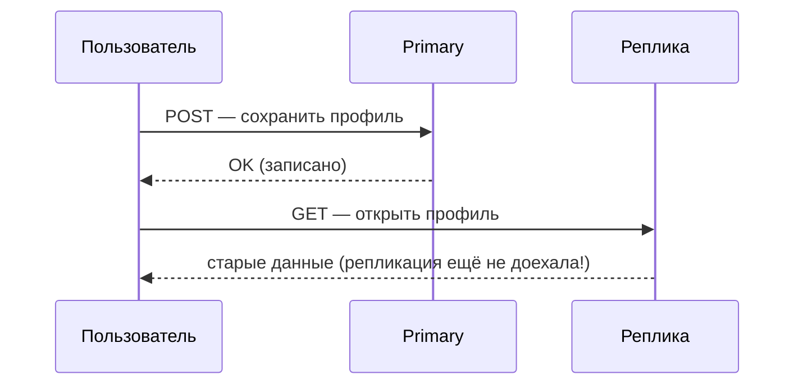

# Чтение с реплик и согласованность

Раскидать чтения по репликам — самый простой способ масштабирования. Но у
него есть подвох, который прямо касается корректности данных: реплика
**отстаёт** от primary, и приложение может прочитать устаревшее.

## Проблема: read-after-write

При асинхронной репликации между записью на primary и её появлением на
реплике проходит лаг. Отсюда классический баг:

Пользователь сохранил изменение и сразу открыл страницу — а видит старую
версию, потому что его чтение ушло на реплику, которая ещё не получила его же
запись. Формально это **eventual consistency**: реплики согласуются со
временем, но не мгновенно.

## Как с этим жить

- **Критичное к свежести чтение — с primary.** Данные, которые пользователь
  только что менял и сразу читает (свой профиль, только что созданный заказ),
  читаем с primary. Некритичное к свежести (каталог, аналитика, ленты) —
  с реплик.
- **Read-your-writes**: после записи некоторое время направлять чтения
  этого пользователя на primary (или дождаться, пока реплика догонит нужную
  позицию WAL).
- **Мониторить лаг репликации** и выводить реплику из ротации, если она
  отстала слишком сильно.

Практический вывод для собеседования: «читать с реплик» — не бесплатно.
Нужно сознательно делить запросы на «должно быть свежим» (primary) и
«допустимо чуть устаревшее» (реплики), иначе получаем плавающие баги вида
«сохранил, а не появилось».

## В приложении

На уровне Spring чтение с реплик организуют:

- Маршрутизацией DataSource: транзакции `@Transactional(readOnly = true)`
  отправляют на реплику, обычные — на primary (`AbstractRoutingDataSource`
  или готовые решения).
- На уровне инфраструктуры — прокси перед БД (PgBouncer/pgpool,
  спец-балансировщики), который сам раскидывает read/write.

Важно, что `readOnly = true` — это ещё и подсказка Hibernate (не делать
dirty checking) и маркер намерения; связкой с маршрутизацией он превращается
в «эту транзакцию можно на реплику».

## Как ответить на интервью

Коротко: чтение с реплик масштабирует нагрузку, но реплика отстаёт
(асинхронная репликация → лаг), поэтому возможен read-after-write баг:
пользователь сохранил и сразу читает со свежей реплики старые данные — это
eventual consistency. Лечим осознанным делением: критичное к свежести
(только что изменённое этим же пользователем) — с primary, некритичное
(каталоги, аналитика) — с реплик; плюс мониторинг лага. В Spring это
маршрутизация DataSource по `readOnly`-транзакциям.
