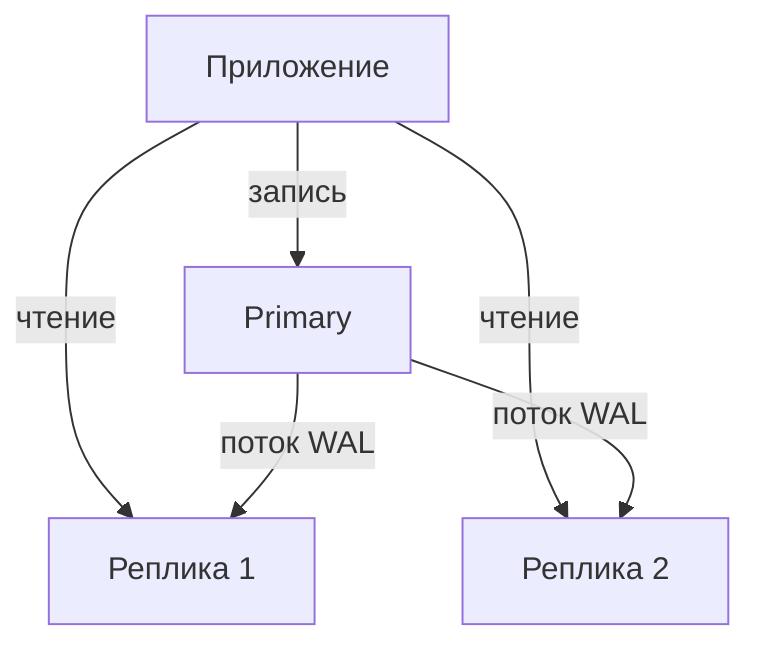

# Репликация

Репликация — поддержание **копий** базы на нескольких серверах. Одна база
перестаёт справляться по двум причинам: нужна отказоустойчивость (сервер
упал — данные и сервис не должны исчезнуть) и нужно масштабировать чтение
(один сервер не тянет поток запросов). Репликация решает обе.

## Primary и реплики

Классическая схема PostgreSQL — **один primary (мастер) и одна-несколько
реплик**:

- **Primary** принимает все записи (`INSERT`/`UPDATE`/`DELETE`).
- **Реплики** получают поток изменений с primary и применяют их у себя;
  обслуживают запросы на **чтение**.

Передаётся именно **WAL** — тот самый журнал упреждающей записи (см.
«Транзакции и ACID»): primary шлёт репликам поток записей WAL, они его
проигрывают и получают такое же состояние. Это называется потоковой
репликацией.

## Синхронная и асинхронная

Ключевой выбор — ждёт ли primary подтверждения от реплики перед тем, как
ответить клиенту «закоммичено»:

- **Асинхронная (по умолчанию)** — primary коммитит и сразу отвечает
  клиенту, не дожидаясь реплик. Быстро, но есть **лаг репликации**: реплика
  отстаёт на доли секунды–секунды. Если primary упадёт в этот момент,
  последние транзакции, не доехавшие до реплики, потеряются.
- **Синхронная** — primary ждёт подтверждения хотя бы одной реплики, что та
  записала транзакцию, и только потом отвечает клиенту. Потери данных при
  падении primary нет, но каждая запись медленнее (плюс round-trip до
  реплики), и если синхронная реплика недоступна — записи встают.

Компромисс: синхронная реплика ради надёжности + асинхронные ради
масштабирования чтения.

## Отказоустойчивость и failover

Если primary падает, одну из реплик **повышают** до primary (failover).
Он бывает:

- **Ручной** — админ переключает.
- **Автоматический** — за этим следит внешний инструмент (Patroni,
  repmgr): детектирует падение, выбирает и промоутит реплику, переключает
  трафик.

Важные тонкости, о которых спрашивают:

- **Split-brain** — если старый primary «ожил», а реплику уже повысили,
  окажутся два primary, оба принимают записи — расхождение данных. Механизмы
  failover специально это предотвращают (fencing — старый primary
  изолируют).
- При асинхронной репликации failover может **потерять** последние транзакции,
  не успевшие доехать. Это цена скорости.

## Как ответить на интервью

Коротко: репликация — копии базы на нескольких серверах ради
отказоустойчивости и масштабирования чтения. В PostgreSQL — потоковая
репликация WAL: primary принимает записи, реплики проигрывают журнал и
обслуживают чтение. Главный выбор — асинхронная (быстро, но есть лаг и риск
потерять последние транзакции при падении) против синхронной (primary ждёт
реплику — без потерь, но медленнее). При падении primary делают failover —
повышают реплику; автоматизируют его Patroni/repmgr, и важно не допустить
split-brain.
