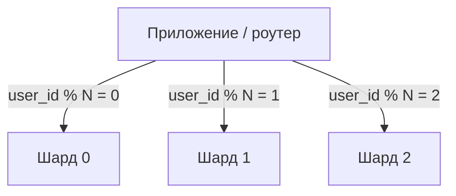

# Шардирование

Шардирование — горизонтальное разбиение данных по **нескольким серверам
(шардам)**, каждый из которых хранит свою часть данных и обслуживает её сам.
Это последний рубеж масштабирования: когда данные или нагрузка на запись не
влезают в один сервер, реплики уже не помогают (они масштабируют только
чтение, а запись по-прежнему вся идёт на один primary).

## Идея

Данные делят по **ключу шардирования** (shard key). Например, пользователей —
по `user_id`: пользователи 1–1млн на шарде A, 1млн–2млн на шарде B. Запрос
«данные пользователя 5» приложение (или прокси) направляет сразу на нужный
шард.

Каждый шард — полноценная БД (у него могут быть свои реплики). В сумме они
держат объём, недоступный одному серверу.

## Как выбирают ключ шардирования

Это самое важное и трудное решение — поменять его потом очень дорого:

- **Равномерность.** Ключ должен раскидывать данные и нагрузку ровно, без
  «горячих» шардов. Шардировать по стране — плохо (один крупный рынок
  перегрузит свой шард); по `user_id` через хеш — обычно ровно.
- **Локальность запросов.** Ключ выбирают так, чтобы частые запросы били в
  **один** шард. Если шардировали по `user_id`, а половина запросов —
  межпользовательские, придётся ходить по всем шардам.

Способы распределения: по хешу ключа (равномерно, но диапазонные запросы
идут по всем шардам), по диапазону (диапазонные запросы локальны, но риск
перекоса), через справочник (directory) — гибко, но лишний хоп.

## Чем платим

Шардирование ломает удобства единой БД:

- **Запросы между шардами** — `JOIN`/агрегаты по данным разных шардов
  невозможны одним SQL; приходится собирать в приложении (scatter-gather) —
  медленно и сложно.
- **Транзакции между шардами** — обычная ACID-транзакция работает в пределах
  одного шарда. Атомарность через несколько шардов требует распределённых
  транзакций (2PC) или саг — дорого и сложно.
- **Ребалансировка** — при добавлении шарда часть данных надо переехать.
  «В лоб» (`hash % N`) при смене N переносит почти всё; поэтому применяют
  **консистентное хеширование** или заранее нарезают много логических
  партиций (виртуальные шарды).
- **Уникальность и генерация id** — auto-increment на каждом шарде свой,
  глобальную уникальность обеспечивают UUID или спец-генераторы (снежинки).

## Когда точно нужно

Практический ориентир: шардирование — **крайняя мера**. Сначала выжимают
вертикальное масштабирование (мощнее сервер), индексы, реплики для чтения,
кэш, партиционирование. Шардируют, когда объём/поток записи реально
превышает возможности одного сервера — потому что сложность растёт резко.

## Как ответить на интервью

Коротко: шардирование — разбиение данных по нескольким серверам по ключу
шардирования; масштабирует и запись, и объём, чего репликация не даёт.
Ключ выбирают ради равномерности (без горячих шардов) и локальности (частый
запрос — в один шард), и поменять его потом крайне дорого. Плата большая:
кросс-шардовые `JOIN` и транзакции по сути невозможны обычным способом,
нужна ребалансировка (консистентное хеширование), глобальные id через UUID.
Поэтому шардирование — крайняя мера после вертикального роста, реплик, кэша
и партиционирования.
