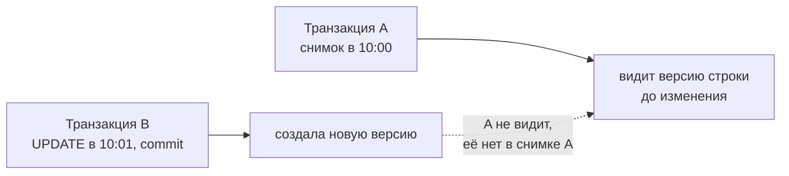

# MVCC в PostgreSQL

MVCC (Multi-Version Concurrency Control) — механизм, за счёт которого
PostgreSQL даёт изоляцию транзакций почти без блокировок на чтение. Главный
принцип: **читатели не блокируют писателей, писатели не блокируют читателей.**
Это ключевое отличие от СУБД, где чтение ставит блокировку.

## Идея: несколько версий строки

При `UPDATE` PostgreSQL **не перезаписывает строку на месте**, а создаёт
новую версию, а старую помечает как устаревшую. В любой момент в таблице
может физически лежать несколько версий одной логической строки. Каждая
транзакция видит ту версию, которая была актуальна на момент её снимка.

Служебные поля каждой версии строки:

- **`xmin`** — id транзакции, которая эту версию **создала**.
- **`xmax`** — id транзакции, которая эту версию **удалила/заменила**
  (пусто, пока версия актуальна).

## Снимок (snapshot) и видимость

Транзакция при старте (или каждый оператор — на Read Committed) получает
**снимок**: набор транзакций, которые уже зафиксированы. Версия строки видна
транзакции, если:

- её `xmin` — уже зафиксированная транзакция (создатель закоммичен), **и**
- её `xmax` пуст или принадлежит ещё не зафиксированной транзакции (никто
  «видимый» её не удалил).

Отсюда напрямую следуют уровни изоляции: **Read Committed** берёт свежий
снимок на каждый оператор (поэтому видит чужие свежие коммиты между
запросами), **Repeatable Read** берёт один снимок на всю транзакцию (поэтому
картина стабильна). Никаких блокировок для этого не нужно — просто разным
транзакциям видны разные версии.

## VACUUM: обратная сторона

У модели «не перезаписываем, а плодим версии» есть цена — **мёртвые версии
строк** (dead tuples) накапливаются и занимают место. Их убирает **VACUUM**:

- `VACUUM` помечает место мёртвых версий как свободное для переиспользования.
- **Autovacuum** — фоновый процесс, делает это автоматически; он же обновляет
  статистику для планировщика.
- **Bloat (раздувание)** — если мёртвых версий накопилось много (частые
  массовые `UPDATE`/`DELETE`, долгие открытые транзакции мешают вакууму), —
  таблица и индексы пухнут, запросы замедляются. `VACUUM FULL` физически
  ужимает таблицу, но берёт тяжёлую блокировку (в проде — осторожно).

Практический вывод: **долгие открытые транзакции вредны** — они удерживают
снимок, из-за которого vacuum не может убрать старые версии, и база пухнет.
Ещё одна причина держать транзакции короткими.

## Что это даёт

- Высокий параллелизм: аналитический `SELECT` не мешает потоку `UPDATE`.
- Консистентное чтение без блокировок: длинный отчёт видит согласованный
  снимок, не мешая записи.
- Плата — фоновая уборка (vacuum) и внимание к долгим транзакциям.

## Как ответить на интервью

Коротко: MVCC — PostgreSQL хранит несколько версий строки, поэтому читатели
и писатели не блокируют друг друга. `UPDATE` не перезаписывает строку, а
создаёт новую версию (поля `xmin`/`xmax` определяют, кто её создал и удалил);
транзакция видит версии по своему снимку. На этом же построены уровни
изоляции: Read Committed — снимок на каждый оператор, Repeatable Read — один
снимок на транзакцию. Плата — мёртвые версии, которые убирает VACUUM/
autovacuum; долгие транзакции мешают уборке и раздувают базу — ещё причина
держать их короткими.
