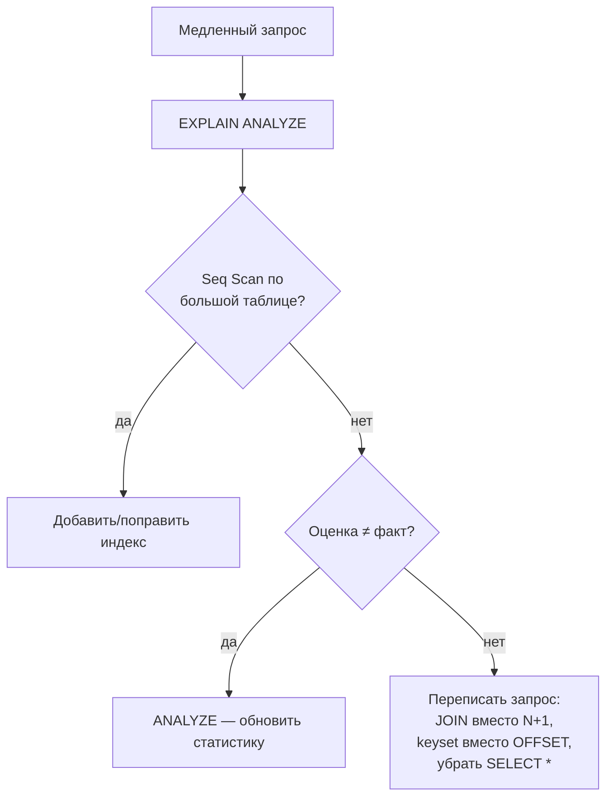

# Производительность запросов

Когда запрос тормозит, гадать не нужно — СУБД сама рассказывает, как она его
выполняет. Главный инструмент в PostgreSQL — `EXPLAIN`.

## EXPLAIN и EXPLAIN ANALYZE

- `EXPLAIN <query>` — показывает **план** без выполнения: какие сканы,
  соединения, оценку стоимости и числа строк.
- `EXPLAIN ANALYZE <query>` — реально **выполняет** запрос и показывает
  фактическое время и число строк. `ANALYZE` выполняет `UPDATE`/`DELETE` —
  на них оборачивать в транзакцию с `ROLLBACK`.

Что читать в плане:

- **Тип скана**: `Seq Scan` (полный перебор — для маленьких таблиц норма, для
  больших с фильтром — сигнал об отсутствии индекса), `Index Scan`,
  `Index Only Scan` (данные взяты прямо из индекса), `Bitmap Heap Scan`.
- **Тип соединения**: `Nested Loop` (мало строк), `Hash Join`, `Merge Join`.
- **Расхождение оценки и факта**: если планировщик ждал 10 строк, а пришло
  100 000 — статистика устарела, помогает `ANALYZE table` (обновить
  статистику; её же периодически обновляет autovacuum).

## Типовые причины медленных запросов

- **Нет подходящего индекса** → `Seq Scan` по большой таблице. Решение —
  индекс на столбцы фильтра/соединения.
- **N+1** (частый в ORM): вместо одного запроса с `JOIN` приложение делает
  1 запрос за списком и по одному за каждой связью. Лечится `JOIN`/`join
  fetch`. Подробно — в разделе про Hibernate.
- **Индекс не применяется** из-за функции над столбцом или приведения типов
  (см. «Индексы»).
- **`SELECT *`** тянет лишние столбцы (в т.ч. тяжёлые `text`/`jsonb`) и мешает
  index-only scan — выбираем только нужные поля.
- **`OFFSET` при глубокой пагинации**: `OFFSET 100000` заставляет БД
  прочитать и отбросить 100 000 строк. Решение — keyset-пагинация
  (`WHERE id > :last`), см. раздел про пагинацию в Spring Data JPA.
- **Много строк на клиент**: тянуть всю таблицу и фильтровать в приложении
  вместо `WHERE`/`LIMIT` в БД.

## Порядок действий при «тормозит запрос»

Общий принцип: сначала измеряем (`EXPLAIN ANALYZE`), потом чиним конкретную
причину, а не оптимизируем вслепую.

## Как ответить на интервью

Коротко: не гадаю, а смотрю план — `EXPLAIN ANALYZE`. В плане ищу `Seq Scan`
по большой таблице (обычно значит «нет индекса»), расхождение оценки и факта
(устаревшая статистика → `ANALYZE`) и тип соединения. Типовые причины
тормозов: отсутствующий индекс, N+1 из ORM, индекс не применился из-за
функции над столбцом, `SELECT *`, глубокий `OFFSET`. Чиню адресно под то,
что показал план.
