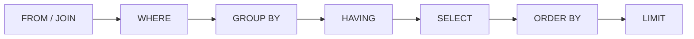

# Выборка данных

`SELECT` — основа работы с реляционной БД. Важно не только знать синтаксис,
но и понимать **порядок**, в котором СУБД логически обрабатывает запрос — он
отличается от порядка написания и объясняет большинство ошибок новичка.

## Порядок логической обработки

Пишем мы так:

```sql
SELECT   u.email, count(o.id) AS orders
FROM     users u
JOIN     orders o ON o.user_id = u.id
WHERE    u.created_at > '2025-01-01'
GROUP BY u.email
HAVING   count(o.id) > 5
ORDER BY orders DESC
LIMIT    10;
```

А СУБД логически выполняет в другом порядке:



Отсюда следуют практические правила:

- **`WHERE` фильтрует до группировки, `HAVING` — после.** Условие на отдельные
  строки — в `WHERE`; условие на агрегат (`count > 5`) — в `HAVING`.
- **Алиас из `SELECT` не виден в `WHERE`** (SELECT выполняется позже), но
  виден в `ORDER BY`.
- `LIMIT` применяется в самом конце — по уже отсортированному результату.

## JOIN

`JOIN` соединяет строки двух таблиц по условию. Виды:

| JOIN | Что возвращает |
|---|---|
| `INNER JOIN` | только совпавшие пары (по умолчанию) |
| `LEFT JOIN` | все строки левой + совпавшие правой (нет пары → `NULL`) |
| `RIGHT JOIN` | зеркально `LEFT` |
| `FULL JOIN` | все строки обеих таблиц |
| `CROSS JOIN` | декартово произведение (все со всеми) |

Типичный смысл: `INNER` — «заказы с их пользователями», `LEFT` — «все
пользователи, у кого-то заказов нет». Частая ошибка — условие на правую
таблицу `LEFT JOIN` в `WHERE`: `WHERE o.status = 'paid'` отбросит строки, где
`o` весь `NULL`, и `LEFT` превратится в `INNER`. Такое условие место — в `ON`.

## NULL

`NULL` — это «неизвестно», а не «пусто» и не ноль. Отсюда:

- Сравнение с `NULL` даёт не `true`/`false`, а «неизвестно»: `x = NULL`
  никогда не истинно. Проверять только через `IS NULL` / `IS NOT NULL`.
- `NULL` в арифметике/конкатенации даёт `NULL`.
- Агрегаты (`count(col)`, `sum`) **пропускают** `NULL`; `count(*)` считает
  строки целиком.
- Убрать `NULL` из результата: `COALESCE(col, 'default')`.

## Подзапросы и CTE

- **Подзапрос** — `SELECT` внутри другого (`WHERE id IN (SELECT ...)`).
- **CTE** (`WITH ... AS`) — именованный подзапрос перед основным: читается
  сверху вниз, удобно для сложной логики и рекурсии (`WITH RECURSIVE` —
  обход деревьев/иерархий).
- **Оконные функции** (`row_number() OVER (PARTITION BY ... ORDER BY ...)`) —
  вычисление по «окну» строк **без** схлопывания их в одну, в отличие от
  `GROUP BY`. Классика — «первый заказ каждого пользователя», «ранг».

## Как ответить на интервью

Коротко: ключ к `SELECT` — понимать порядок логической обработки
(`FROM → WHERE → GROUP BY → HAVING → SELECT → ORDER BY → LIMIT`): из него
следует, почему `WHERE` не видит агрегаты и алиасы, а `HAVING` фильтрует уже
сгруппированное. `JOIN` соединяет таблицы, `INNER` — только совпадения,
`LEFT` — все левые; условие на правую таблицу `LEFT JOIN` держим в `ON`,
не в `WHERE`. `NULL` — «неизвестно», сравнивается только через `IS NULL`.
Для сложных выборок — CTE и оконные функции, которые считают по группе,
не схлопывая строки.
