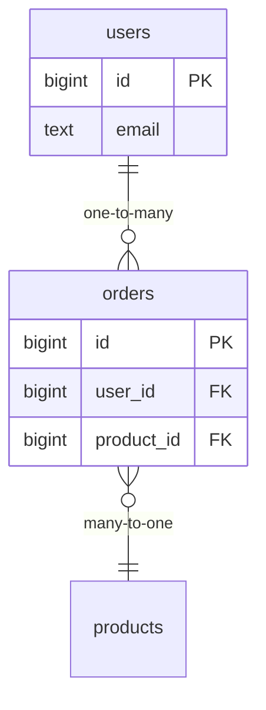

# Реляционная модель

Реляционная база хранит данные в **таблицах** (отношениях): строка — один
объект (запись), столбец — его атрибут с фиксированным типом. Вся модель
строится на том, что таблицы связаны между собой по значениям, а не по
ссылкам в памяти.

## Ключи и связи

- **Первичный ключ (PK)** — столбец (или набор), однозначно определяющий
  строку. Обычно суррогатный — `id` (auto-increment/`SERIAL`/`BIGSERIAL`
  или UUID), а не «естественный» вроде email: естественные ключи меняются,
  суррогатные — нет.
- **Внешний ключ (FK)** — столбец, ссылающийся на PK другой таблицы. Именно
  так выражаются связи: у заказа есть `user_id`, указывающий на `users.id`.
- **Связи**: один-ко-многим (у пользователя много заказов — FK на стороне
  «многих»), многие-ко-многим (через промежуточную таблицу с двумя FK),
  один-к-одному (реже, FK + `UNIQUE`).

## Ограничения целостности

Это то, что не даёт данным «сломаться» на уровне самой БД — их проверяет
сервер, а не приложение:

| Ограничение | Гарантирует |
|---|---|
| `PRIMARY KEY` | уникальность + `NOT NULL`, идентификация строки |
| `FOREIGN KEY` | ссылка ведёт на существующую строку (нет «висячих» ссылок) |
| `UNIQUE` | нет дублей по столбцу (например, email) |
| `NOT NULL` | значение обязательно |
| `CHECK` | произвольное условие (`age >= 0`) |
| `DEFAULT` | значение по умолчанию |

Отдельно у FK есть поведение при удалении родителя: `ON DELETE RESTRICT`
(запретить, по умолчанию), `CASCADE` (удалить и детей), `SET NULL`.

## Нормализация — коротко

Нормализация — разложение данных так, чтобы каждый факт хранился **в одном
месте**. Практический ориентир — третья нормальная форма (3НФ): нет
повторяющихся групп, все атрибуты зависят от ключа целиком и только от ключа.
Смысл — убрать аномалии обновления: если адрес пользователя лежит в каждой
строке заказа, при переезде придётся править все строки, и часть забудется.

Обратная сторона — **денормализация**: осознанное дублирование ради скорости
чтения (меньше `JOIN`). На собесе достаточно сказать: по умолчанию
нормализуем, денормализуем точечно под конкретную нагрузку на чтение.

## Как ответить на интервью

Коротко: реляционная модель — данные в таблицах, связи выражаются
значениями через первичные и внешние ключи, а не ссылками. Целостность
держат ограничения (`PK`, `FK`, `UNIQUE`, `NOT NULL`, `CHECK`) — их
проверяет сама БД, поэтому на них можно опираться. Нормализация хранит
каждый факт в одном месте и убирает аномалии обновления; денормализация —
осознанный размен целостности на скорость чтения.
