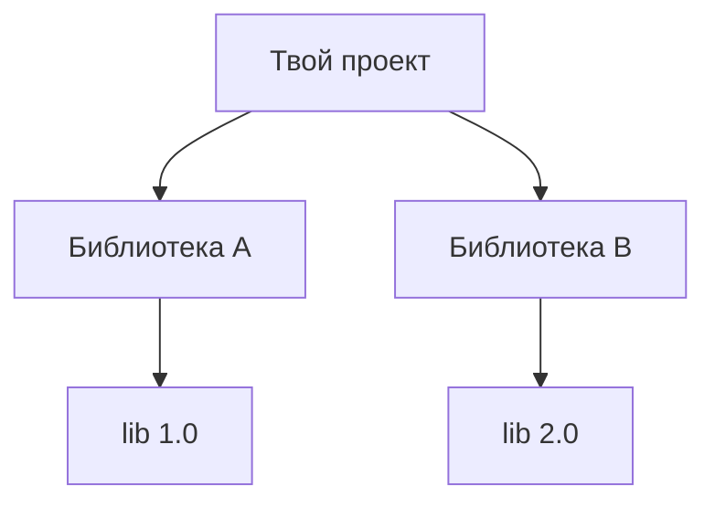

# Зависимости и конфликты

Управление зависимостями — не только «подключить библиотеку». Библиотеки тянут
**свои** зависимости, версии пересекаются и конфликтуют. Понимать, как это
разруливается, полезно: «diamond»-конфликты версий — частая реальная боль.

## Транзитивные зависимости

Подключив одну библиотеку, ты получаешь и **её** зависимости — они тянутся
автоматически (транзитивно). Обычно это удобно: не надо перечислять всё вручную.
Но именно отсюда растут конфликты версий.

## Конфликт версий (diamond)

Ситуация: библиотека A требует `lib 1.0`, библиотека B — `lib 2.0`. В classpath
может быть только **одна** версия `lib`. Какую взять?

- **Maven** берёт версию по правилу **ближайшей в дереве** зависимостей (nearest
  wins) — кто ближе к корню, тот и победил.
- **Gradle** по умолчанию берёт **самую свежую** из требуемых.

Проблема в том, что выбранная версия может оказаться несовместимой с той
библиотекой, что ждала другую, — отсюда странные ошибки в рантайме
(`NoSuchMethodError`, `ClassNotFoundException`), хотя код компилируется.

## Как разбираться

- Посмотреть **дерево зависимостей**: `mvn dependency:tree` или
  `./gradlew dependencies` — видно, кто что и какой версии тянет.
- **Зафиксировать версию** явно или исключить лишнюю транзитивную (`exclusions` в
  Maven).
- В Spring Boot проще — есть **BOM** (Bill of Materials): `spring-boot-starter-parent`
  задаёт согласованный набор версий всех библиотек, и их не надо указывать
  вручную. Это снимает большую часть конфликтов.

## Стартеры Spring Boot

`spring-boot-starter-*` — это «наборы» зависимостей под задачу. Один
`spring-boot-starter-web` подтягивает Spring MVC, встроенный Tomcat, Jackson —
согласованными версиями. Не надо собирать зоопарк библиотек руками и следить за
совместимостью.

## Как ответить на интервью

Коротко: библиотеки тянут свои зависимости транзитивно, и версии конфликтуют —
классический diamond: A хочет `lib 1.0`, B — `lib 2.0`, а в classpath версия может
быть одна. Maven выбирает ближайшую в дереве, Gradle — самую свежую; неудачный
выбор даёт рантайм-ошибки вроде `NoSuchMethodError`. Разбираюсь через дерево
зависимостей (`mvn dependency:tree` / `gradle dependencies`), фиксирую или
исключаю нужную версию. В Spring Boot проще — **BOM** и **стартеры** задают
согласованный набор версий, поэтому большинства конфликтов просто не возникает.
