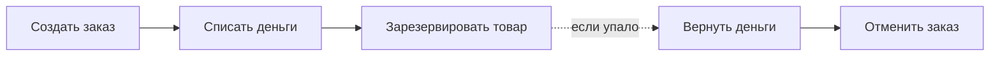

# Согласованность данных и Saga

Главная боль микросервисов: у каждого своя база, и **одной транзакции на всех
нет**. Бизнес-операция часто затрагивает несколько сервисов (создать заказ →
списать деньги → зарезервировать товар), и нужно, чтобы система осталась в
согласованном состоянии, даже если посередине что-то упало. Это ключевая тема
распределёнки.

## Почему нельзя просто транзакцию

В монолите три действия в одной БД-транзакции: не удалось списать деньги —
откатилось всё. В микросервисах у заказов, оплаты и склада **разные базы**.
Обёрнуть их в общую ACID-транзакцию невозможно — базы друг о друге не знают.

## Двухфазный коммит (2PC) и почему его избегают

Есть протокол распределённой транзакции — **2PC**: координатор сначала спрашивает
все стороны «готовы?» (prepare), и если все согласны — командует «коммит».

- **Минусы:** все участники **блокируются** в ожидании координатора; если
  координатор упал в середине — стороны зависли; плохо масштабируется и роняет
  доступность.
- На практике в микросервисах 2PC **почти не используют** — слишком дорого по
  доступности. Вместо него берут Saga.

## Saga

**Идея:** большую операцию разбивают на цепочку **локальных транзакций**, каждая
в своём сервисе. Каждый шаг публикует событие/вызывает следующий. Если шаг
провалился — запускаются **компенсирующие** действия, отменяющие уже сделанное.

Ключевое: вместо «откатить общую транзакцию» — **семантическая компенсация**.
Деньги уже списаны и товара нет? Значит, отдельным действием возвращаем деньги.
Итог — **итоговая согласованность**: система приходит в согласованное состояние
не мгновенно, а после отработки всех шагов/компенсаций.

## Два способа управлять Sagой

- **Хореография** — централизованного управляющего нет. Каждый сервис слушает
  события и публикует свои. Заказ создан → событие → оплата реагирует и публикует
  своё → склад реагирует. Просто для коротких цепочек, но при росте логика
  размазывается по сервисам и её тяжело проследить.
- **Оркестрация** — есть **координатор** (оркестратор), который по шагам дёргает
  сервисы и решает, что делать при сбое. Логика процесса в одном месте — легче
  понять и менять, но координатор — дополнительный компонент.

## Чем расплачиваемся

- Нет мгновенной согласованности — есть **промежуточные состояния** (деньги уже
  списаны, товар ещё не зарезервирован). Их нужно продумать.
- Нужны **компенсирующие** действия на каждый шаг — не всегда очевидные (как
  «отменить» отправленное письмо?).
- Шаги должны быть **идемпотентными** — сообщение может прийти повторно.

## Как ответить на интервью

Коротко: в микросервисах у каждого своя база, общей транзакции нет, поэтому
операцию через несколько сервисов нельзя откатить одним rollback. Распределённый
2PC есть, но его избегают — он блокирует участников и роняет доступность. Вместо
этого — **Saga**: операцию бьют на цепочку локальных транзакций, каждая в своём
сервисе, а при сбое запускаются **компенсирующие** действия, отменяющие уже
сделанное (вернуть деньги, отменить заказ). Управлять можно **хореографией**
(сервисы реагируют на события друг друга) или **оркестрацией** (координатор ведёт
процесс по шагам). Итог — итоговая согласованность; расплата — промежуточные
состояния, необходимость компенсаций и идемпотентность шагов.
