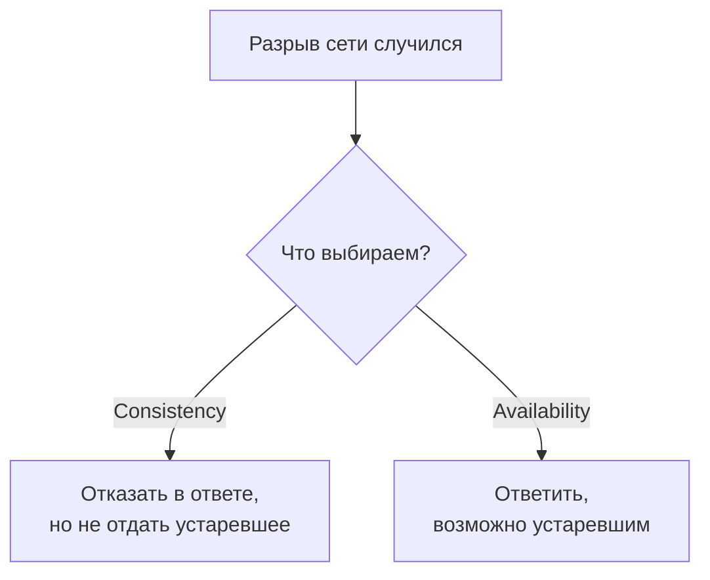

# Проблемы распределённых систем и CAP

Как только части системы общаются **по сети**, а не вызовами методов в одном
процессе, появляется набор проблем, которых в монолите просто нет. Понимать их
важно: из них растут все паттерны распределёнки (устойчивость, Saga, Outbox,
идемпотентность).

## Сеть ненадёжна

Главный источник сложности — **сеть может подвести в любой момент**:

- запрос может **не дойти**, дойти **с задержкой** или прийти **дважды**;
- ответ может потеряться, хотя операция на той стороне **уже выполнилась**;
- удалённый сервис может быть перегружен, отвечать медленно или лежать.

Отсюда следствие: вызвав чужой сервис и не получив ответа, ты **не знаешь**,
выполнилась операция или нет. Это меняет всё — приходится закладывать таймауты,
повторы и защиту от дублей.

Есть известный список **заблуждений о распределённых системах** (fallacies): «сеть
надёжна», «задержка нулевая», «пропускная способность бесконечна», «сеть
безопасна». На практике всё наоборот — и код должен это учитывать.

## Нет общего состояния и общей транзакции

В монолите одна БД и одна транзакция: либо всё применилось, либо всё
откатилось. В распределённой системе у каждого сервиса **своя база**, и одной
транзакции на всех нет. Обновить данные в двух сервисах атомарно **нельзя** — и
это порождает проблему согласованности (её решают Saga и Outbox).

## Теорема CAP

CAP описывает фундаментальный компромисс для распределённого хранилища. Из трёх
свойств одновременно достижимы только **два**:

- **C (Consistency)** — все узлы видят одни и те же актуальные данные.
- **A (Availability)** — система отвечает на запросы, даже если часть узлов
  недоступна.
- **P (Partition tolerance)** — система продолжает работать при разрыве сети
  между узлами.

Ключевая мысль: **разрывы сети (P) неизбежны**, поэтому в реальности выбор идёт
между **C и A**. Когда сеть разорвана, система либо отказывает в ответе ради
консистентности (CP), либо отвечает возможно устаревшими данными ради доступности
(AP). Это не «настройка», а осознанный компромисс под задачу: банковский баланс
скорее CP, лента новостей скорее AP.

## Итоговая согласованность

Многие распределённые системы выбирают доступность и работают в модели
**eventual consistency** (итоговая согласованность): данные на узлах какое-то
время расходятся, но **со временем сходятся**. Пример — реплики БД: чтение с
реплики может вернуть чуть устаревшие данные, зато система быстрее и доступнее.
Это нормально для многих сценариев, но нужно осознанно решать, где такое
допустимо, а где нужна строгая согласованность.

## Как ответить на интервью

Коротко: как только части общаются по сети, появляются проблемы, которых нет в
монолите. Главная — сеть ненадёжна: запрос может не дойти, задержаться или прийти
дважды, а ответ потеряться, хотя операция уже выполнилась; поэтому, не получив
ответа, ты не знаешь её исход — нужны таймауты, повторы и защита от дублей. Второе
— нет общей транзакции: у каждого сервиса своя база, атомарно обновить два нельзя,
отсюда Saga и Outbox. Теорема **CAP** говорит, что из consistency, availability и
partition tolerance одновременно берут два; разрывы сети неизбежны, так что
реально выбираешь между согласованностью и доступностью. Многие системы выбирают
доступность и **итоговую согласованность** — данные сходятся не сразу, но сходятся.
