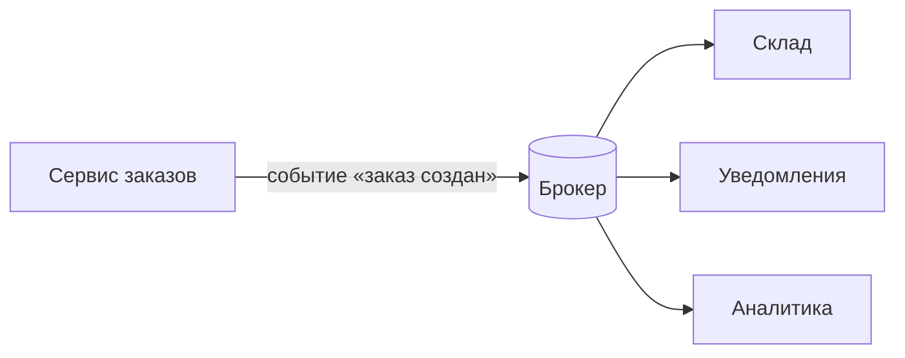

# Событийная архитектура

**Событийная архитектура (Event-Driven Architecture, EDA)** — стиль построения
системы, в котором сервисы общаются не прямыми вызовами, а **событиями**: один
сервис объявляет «случился факт», а другие сами на это реагируют. Это зонтичное
название над уже знакомыми вещами (брокер, Kafka, outbox, saga) — полезно уметь
назвать сам подход и объяснить его суть.

## Что такое событие

**Событие** — сообщение о том, что **уже произошло**: `заказ создан`,
`оплата прошла`, `пользователь зарегистрировался`. Ключевое — это факт в
прошедшем времени, а не команда «сделай что-то».

- Издатель события **не знает**, кто и как его обработает, и **не ждёт** ответа.
- Событие уходит в **брокер** (Kafka, RabbitMQ), а подписчики читают его, когда
  смогут.

Сравни с обычным вызовом: при команде «проведи оплату» отправитель обращается к
конкретному сервису и ждёт результат; при событии «заказ создан» он просто
сообщает факт — а кто на него подпишется (склад, уведомления, аналитика), его не
касается.

## В чём суть и зачем это

Главная идея — **инверсия зависимости** между сервисами. При прямом вызове
инициатор знает получателя и зависит от него; в EDA издатель знает только про
событие, а получатели сами решают, слушать ли его.

Отсюда свойства:

- **Слабая связанность** — издатель не привязан к получателям; можно добавить
  нового подписчика (например, новый сервис аналитики), не трогая издателя.
- **Устойчивость** — получатель может временно лежать, событие подождёт в
  брокере; сбой одного подписчика не роняет остальных и не роняет издателя.
- **Масштабируемость и асинхронность** — обработка идёт параллельно и в своём
  темпе, издатель не ждёт.

Плата за это — та же, что у любого асинхронного общения: сложнее проследить
сквозной поток, появляется **итоговая согласованность** и нужна
**идемпотентность** (событие может прийти дважды).

## Где это в конспекте

EDA — это не отдельная технология, а способ собрать вместе уже разобранные части:

- механика обмена — [Коммуникация сервисов](service-communication.md) и раздел
  [Kafka](../../integration/kafka/what-is-kafka.md);
- надёжно опубликовать событие вместе с изменением в БД —
  [Outbox](outbox.md);
- не обработать одно событие дважды — [Идемпотентность](idempotency.md);
- держать согласованность бизнес-процесса без распределённых транзакций —
  [Saga](consistency-saga.md).

## Как ответить на интервью

Коротко: событийная архитектура — это когда сервисы общаются не прямыми вызовами,
а **событиями** — сообщениями о том, что уже произошло («заказ создан»). Издатель
кидает событие в брокер (Kafka) и не знает и не ждёт, кто его обработает, а
подписчики читают, когда смогут. Суть — инверсия зависимости: издатель зависит
только от события, а не от получателей. Отсюда слабая связанность (легко добавить
нового подписчика, не трогая издателя), устойчивость (получатель может полежать,
событие подождёт в брокере) и асинхронная обработка. Плата — сложнее проследить
поток, итоговая согласованность и нужна идемпотентность, потому что событие может
прийти дважды.
