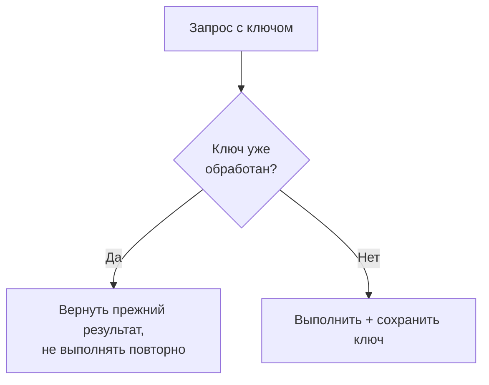

# Идемпотентность и дедупликация

Идемпотентность — свойство операции давать **одинаковый результат при повторном
выполнении**. В распределённых системах это не роскошь, а необходимость: сообщения
дублируются, запросы повторяются, и без защиты от дублей данные разъезжаются.

## Почему дубли неизбежны

Всё сводится к тому, что сеть ненадёжна и, не получив ответа, нельзя узнать исход
операции:

- **Ретраи** повторяют запрос, хотя первый мог уже выполниться (ответ потерялся).
- **Kafka и Outbox** дают доставку *at-least-once* — сообщение может прийти дважды.
- Пользователь дважды нажал «Оплатить», клиент переотправил запрос.

Если операция меняет состояние (списать деньги, создать заказ), повтор без защиты
= двойное списание, дубль заказа. Поэтому обработчики должны быть идемпотентны.

## Идемпотентность «от природы»

Часть операций идемпотентны сами по себе — их можно повторять свободно:

- **Чтение** (`GET`) ничего не меняет.
- **Установка значения**: «сделать статус = PAID» при повторе даёт тот же
  результат (в отличие от «увеличить баланс на 100» — это НЕ идемпотентно).
- В HTTP `PUT` и `DELETE` считаются идемпотентными, `POST` — нет.

Где можно, логику проектируют как «установить состояние», а не «применить дельту».

## Дедупликация по ключу идемпотентности

Когда операция по своей природе не идемпотентна (перевод денег), её делают
идемпотентной через **ключ идемпотентности** (idempotency key):

1. Клиент присылает уникальный ключ операции (в HTTP — заголовок
   `Idempotency-Key`; в сообщении — его `id`).
2. Сервис перед выполнением проверяет, **не обрабатывался** ли этот ключ уже.
3. Если новый — выполняет и **сохраняет ключ** (в БД/Redis). Если уже видел —
   ничего не делает и возвращает прежний результат.

Важно, чтобы проверка-и-сохранение были **атомарными** (уникальное ограничение в
БД или атомарная операция в Redis) — иначе два одновременных дубля оба пройдут
проверку. Часто помогает уникальный индекс: вторая вставка с тем же ключом просто
упадёт, и это ловят как «уже обработано».

## Связь с остальным

Идемпотентность — то, что делает безопасными **ретраи**, **Kafka-консьюмеров**,
**Outbox** и **шаги Saga**. Почти каждый паттерн надёжности в распределёнке
опирается на неё: гарантировать «доставим ровно один раз» на уровне сети дорого,
поэтому доставляют «хотя бы один раз», а дубли гасят идемпотентностью на приёмнике.

## Как ответить на интервью

Коротко: идемпотентность — когда повторное выполнение операции даёт тот же
результат. В распределёнке дубли неизбежны — ретраи, at-least-once в Kafka и
Outbox, двойные клики, — и без защиты повтор means двойное списание. Часть
операций идемпотентны сами (чтение, «установить статус», `PUT`/`DELETE`), а
неидемпотентные (перевод денег) делают идемпотентными через **ключ
идемпотентности**: клиент шлёт уникальный ключ, сервис проверяет, обрабатывал ли
его, и если да — возвращает прежний результат, не выполняя повторно; проверка и
сохранение должны быть атомарными, часто через уникальный индекс. Именно
идемпотентность делает безопасными ретраи, Kafka-консьюмеры, Outbox и Saga.
