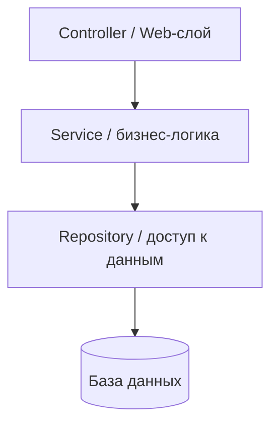

# Слои приложения

Типичное backend-приложение разбивают на **слои** — каждый отвечает за свой
уровень: принять запрос, выполнить бизнес-логику, сходить в базу. Это самый
распространённый способ организовать код, и именно так устроено большинство
Spring-приложений.

## Классические три слоя

- **Controller (web-слой)** — принимает HTTP-запрос, валидирует вход, отдаёт
  ответ. Никакой бизнес-логики: только «получил → передал дальше → вернул».
- **Service (слой бизнес-логики)** — здесь живёт логика: расчёты, правила,
  оркестрация. Слой ничего не знает про HTTP.
- **Repository (слой доступа к данным)** — работа с БД: сохранить, найти,
  обновить. В Spring это интерфейсы Spring Data JPA.

Между слоями часто ходят **разные объекты**: наружу отдаём DTO, внутри работаем
с сущностями. Это разделяет внешний контракт API и внутреннюю модель — их можно
менять независимо.

## Зачем это разделение

- Каждый слой занят своим → **высокая связность**, проще читать и тестировать.
- Слои зависят вниз через абстракции → можно подменить БД или протокол, не
  трогая бизнес-логику.
- Логика не размазана по контроллерам («fat controller» — типичный антипаттерн,
  когда вся логика свалена в контроллер).

## Правило зависимостей

Зависимости направлены **сверху вниз**: контроллер знает о сервисе, сервис — о
репозитории. Обратно нельзя: репозиторий не должен знать про контроллер. Так
нижние слои остаются независимыми и переиспользуемыми.

## Гексагональная архитектура (кратко)

Развитие идеи слоёв — **порты и адаптеры** (hexagonal / clean architecture).
Смысл: бизнес-логика в центре и **не зависит ни от чего** внешнего, а всё внешнее
(БД, HTTP, очереди) подключается через интерфейсы-«порты».

- Бизнес-ядро определяет интерфейс `OrderRepository` (порт), а конкретный
  адаптер под PostgreSQL его реализует.
- Это прямое применение принципа инверсии зависимостей: детали зависят от ядра,
  а не наоборот.
- Плюс — ядро легко тестировать и не переписывать при смене БД/фреймворка.
  Минус — больше абстракций и кода, оправдано не в каждом проекте.

Для стажёра достаточно понимать саму идею: **логика в центре, инфраструктура по
краям через интерфейсы**. Классических трёх слоёв хватает для большинства задач.

## Как ответить на интервью

Коротко: приложение делю на слои — контроллер (принять запрос, отдать ответ, без
логики), сервис (бизнес-логика, ничего не знает про HTTP) и репозиторий (доступ к
БД). Наружу отдаю DTO, внутри работаю с сущностями — чтобы контракт API и
внутренняя модель менялись независимо. Зависимости идут сверху вниз, нижние слои
про верхние не знают. Это даёт высокую связность и тестируемость и спасает от
«толстых контроллеров». Как развитие — гексагональная архитектура: бизнес-логика
в центре и не зависит от инфраструктуры, а БД и протоколы подключаются через
порты-интерфейсы; но для большинства задач хватает и обычных трёх слоёв.
