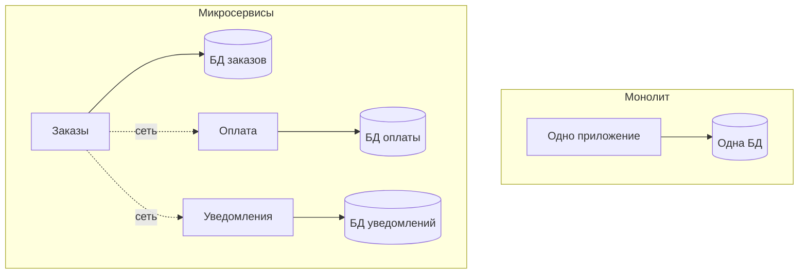

# Монолит и микросервисы

Это два способа разбить систему на части. **Монолит** — всё приложение как один
развёртываемый кусок. **Микросервисы** — набор мелких самостоятельных сервисов,
каждый со своей задачей и своей базой. Важно понимать не только различие, но и
**когда что уместно** — на интервью почти всегда спрашивают «а зачем вообще
микросервисы».

## Монолит

Одно приложение, один процесс, одна база, один деплой. Внутри может быть аккуратно
разложено по слоям и модулям, но собирается и выкатывается как целое.

- **Плюсы:** проще разрабатывать и запускать; вызовы внутри — обычные вызовы
  методов (быстро, надёжно); транзакции и согласованность данных «из коробки»
  (одна БД); проще отлаживать и тестировать.
- **Минусы:** с ростом кодовой базы всё сильнее связывается и тяжелеет; деплой
  целиком ради одной правки; масштабировать можно только всё приложение сразу;
  вся команда толкается в одном репозитории.

## Микросервисы

Система разбита на отдельные сервисы (заказы, оплата, уведомления), каждый —
самостоятельное приложение со своей БД, деплоится независимо, общается с
другими по сети (REST, gRPC, очереди).

- **Плюсы:** независимый деплой и масштабирование каждого сервиса; команды
  работают автономно; отказ одного сервиса можно локализовать; свобода в выборе
  технологий под задачу.
- **Минусы — и их надо назвать честно:** появляется **распределённая система** со
  всеми её сложностями — сеть ненадёжна, вызовы медленнее и могут падать; нет
  общей транзакции, согласованность данных приходится обеспечивать вручную
  (Saga, Outbox); тяжелее тестировать и отлаживать; нужна инфраструктура
  (мониторинг, трейсинг, оркестрация).

## Ключевое отличие — общая БД против сети

В монолите модули зовут друг друга напрямую и делят одну транзакцию — всё либо
применилось, либо откатилось. В микросервисах между частями — **сеть**: вызов
может зависнуть, повториться, прийти дважды или не дойти. Отсюда растут все
паттерны распределённых систем: устойчивость, Saga, Outbox, идемпотентность.

## Когда что выбирать

- **Начинать почти всегда стоит с монолита** (или «модульного монолита» —
  аккуратно разбитого внутри). Он проще, а преждевременное дробление на сервисы —
  частая дорогая ошибка.
- Микросервисы оправданы, когда система и команда **выросли**: разным частям
  нужен независимый деплой и масштабирование, много команд мешают друг другу в
  одном коде.
- Микросервисы — это **не про «современно и правильно», а про решение
  конкретных проблем масштаба** ценой большой дополнительной сложности.

## Как ответить на интервью

Коротко: монолит — одно приложение с одной базой и одним деплоем; проще
разрабатывать, вызовы внутри быстрые, согласованность данных даёт одна
транзакция, но с ростом тяжелеет и масштабируется только целиком. Микросервисы —
набор самостоятельных сервисов со своими базами, независимым деплоем и
масштабированием, но это уже распределённая система: сеть ненадёжна, общей
транзакции нет, согласованность нужно обеспечивать паттернами вроде Saga и
Outbox, плюс тяжёлая инфраструктура. Поэтому по умолчанию я бы начинал с
монолита, а на микросервисы шёл, когда система и команда доросли до реальной
потребности в независимом деплое и масштабировании.
