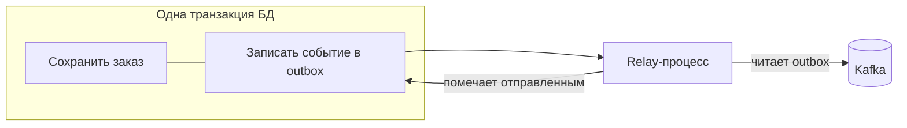

# Outbox и надёжная публикация событий

Очень частый и важный паттерн. Он решает конкретную коварную проблему: как
надёжно **и записать данные в свою БД, и отправить сообщение** в очередь, если
это две разные системы без общей транзакции.

## Проблема двойной записи (dual write)

Типичный сценарий: сервис сохраняет заказ в свою БД **и** публикует событие
`OrderCreated` в Kafka, чтобы другие сервисы отреагировали. Это две разные
системы, общей транзакции между ними нет. Возможны рассинхроны:

- Записали в БД, а **публикация упала** (или сервис умер сразу после коммита) →
  заказ есть, события нет. Другие сервисы о заказе не узнали.
- Опубликовали событие, а **транзакция БД откатилась** → событие ушло, а заказа
  в базе нет. Другие сервисы обработали несуществующий заказ.

Поменять местами не помогает — всегда остаётся окно, где одно прошло, а второе
нет. Атомарно «БД + брокер» не связать.

## Решение — Outbox

Идея: **не публиковать в брокер напрямую из бизнес-транзакции**. Вместо этого в
той же самой БД-транзакции, что и бизнес-данные, писать событие в специальную
таблицу `outbox`.

1. В **одной локальной транзакции** сохраняем заказ и вставляем строку в таблицу
   `outbox`. Раз одна БД — это атомарно: либо оба, либо ничего. Проблема двойной
   записи исчезает.
2. Отдельный процесс (**relay/publisher**) читает новые строки из `outbox` и
   публикует их в брокер, помечая отправленные.
3. Если публикация упала — строка осталась, relay повторит. Событие точно уйдёт.

## Важное следствие — доставка «хотя бы один раз»

Relay может опубликовать событие и упасть **до** того, как пометил его
отправленным. После перезапуска он отправит его повторно. Значит, Outbox даёт
**at-least-once**: событие точно дойдёт, но может продублироваться. Поэтому
потребители обязаны быть **идемпотентными** — уметь обработать дубль без вреда.

## Как relay читает outbox

- Простой вариант — **опрос (polling)**: relay периодически выбирает
  неотправленные строки. Просто, но есть задержка и нагрузка на опрос.
- Продвинутый — **CDC** (Change Data Capture, например Debezium): читает журнал
  изменений БД и публикует события почти в реальном времени, без опроса. Для
  стажёра достаточно знать, что такой способ есть.

## Где это встречается

Outbox — стандартный способ надёжно связать БД и Kafka в микросервисах, часто
идёт в паре с **Saga**: шаги саги обмениваются событиями, а Outbox гарантирует,
что событие каждого шага действительно опубликовано.

## Как ответить на интервью

Коротко: Outbox решает проблему двойной записи — когда надо и сохранить данные в
БД, и отправить событие в брокер, а общей транзакции между ними нет. Если писать в
Kafka напрямую, возможен рассинхрон: БД записалась, а публикация упала, или
наоборот. Решение — в **той же** транзакции с бизнес-данными писать событие в
таблицу `outbox` (это атомарно, одна БД), а отдельный relay-процесс потом читает
таблицу и публикует в брокер, помечая отправленное; упал — повторит. Даёт доставку
at-least-once, поэтому потребители должны быть идемпотентны. Читать outbox можно
опросом или через CDC вроде Debezium. Часто работает в паре с Saga.
