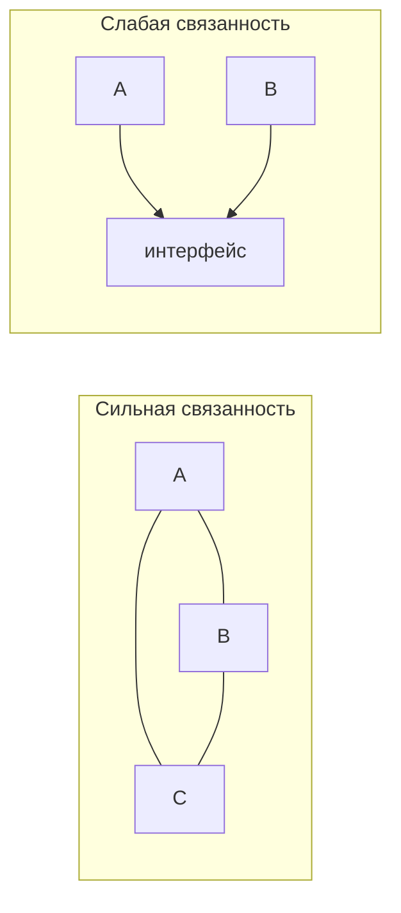

# Другие принципы проектирования

Кроме SOLID есть набор коротких принципов-напоминалок. Они не формальны, но
именно на них чаще всего ссылаются в код-ревью и на интервью, когда speak о
качестве кода.

## DRY — Don't Repeat Yourself

Не дублируй **знание**. Один и тот же кусок логики не должен жить в двух местах:
поправишь в одном, забудешь в другом — получишь баг.

- Дублирование кода выносят в метод, класс или общий модуль.
- Важная оговорка: DRY — про **знание**, а не про случайно похожие строки. Два
  куска кода, которые сейчас выглядят одинаково, но меняются по разным причинам,
  объединять не надо — это создаёт ложную связь.

## KISS — Keep It Simple, Stupid

Делай максимально просто. Самое простое решение, которое работает, почти всегда
лучше умного и запутанного.

- Сложный код труднее читать, тестировать и передавать другим.
- «Умные» однострочники и хитрые абстракции ради красоты — частый источник багов.

## YAGNI — You Aren't Gonna Need It

Не пиши функциональность «на будущее». Реализуй то, что нужно **сейчас**.

- Заготовки «вдруг пригодится» обычно не пригождаются, но их приходится
  поддерживать и они мешают менять код.
- Прямо связано с KISS: не усложняй систему под требования, которых ещё нет.

## Связанность и связность

Два ключевых слова про качество структуры — их часто спрашивают.

- **Связанность (coupling)** — насколько сильно модули зависят друг от друга.
  Цель — **слабая** связанность: поменял один модуль, остальные не задеты.
- **Связность (cohesion)** — насколько логически едино содержимое одного модуля.
  Цель — **высокая** связность: класс занят одной задачей, а не свалкой всего
  подряд.

Хорошая система = **loose coupling + high cohesion**. Это, по сути, итог всего
SOLID одной фразой.

## Композиция вместо наследования

Переиспользовать поведение лучше через **композицию** (объект содержит другой
объект и делегирует ему), а не через наследование.

- Наследование жёстко связывает наследника с родителем и легко нарушает принцип
  Лисков; глубокие иерархии тяжело менять.
- Композиция гибче: поведение можно собрать из частей и подменить в рантайме.
  На этом стоят многие паттерны (Стратегия, Декоратор).

## Закон Деметры

«Не разговаривай с незнакомцами»: объект должен обращаться к своим прямым
соседям, а не лезть вглубь чужих объектов цепочками.

- Плохо: `order.getCustomer().getAddress().getCity()` — код завязан на всю
  внутреннюю структуру. Изменилось что-то в середине цепочки — ломается здесь.
- Лучше, чтобы объект сам отдавал то, что нужно (`order.getShippingCity()`).

## Как ответить на интервью

Коротко: помимо SOLID держу в голове несколько принципов. **DRY** — не
дублировать знание (но не слепо объединять похожий код). **KISS** — делать
максимально просто, сложное труднее сопровождать. **YAGNI** — не писать про запас
то, что нужно только гипотетически. Главная пара понятий — **слабая связанность
и высокая связность**: модули мало зависят друг от друга и каждый занят своим.
Ещё — **композиция вместо наследования** (гибче и не ломает Лисков) и закон
Деметры (не лезть цепочками вглубь чужих объектов).
