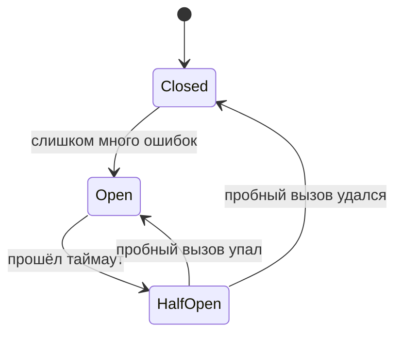

# Устойчивость: таймауты, ретраи, circuit breaker

Раз сеть и чужие сервисы ненадёжны, приложение должно **переживать чужие сбои**,
не падая само и не утаскивая за собой остальных. Набор паттернов устойчивости
(resilience) — как раз про это. Тема важная: именно эти паттерны широко
используются в микросервисах.

## Таймауты

Самое базовое. Любой сетевой вызов должен иметь **таймаут** — предел ожидания
ответа.

- Без таймаута зависший чужой сервис держит твой поток бесконечно. Потоки
  кончаются, и **твой** сервис тоже перестаёт отвечать — сбой распространяется.
- Таймаут превращает «висим вечно» в «быстро получили ошибку и решаем, что
  делать». Это фундамент, на котором стоят остальные паттерны.

## Ретраи (повторы)

Многие сбои **временные** — секундная недоступность, потерянный пакет. Разумно
**повторить** запрос.

- Повторять стоит только **идемпотентные** операции (повторный вызов не навредит)
  и только **временные** ошибки (таймаут, 503), а не бизнес-ошибку вроде
  «неверный пароль».
- Обязательно с **экспоненциальной задержкой** (backoff) и небольшим случайным
  разбросом (jitter): иначе все клиенты одновременно завалят повторами уже
  упавший сервис и добьют его («retry storm»).
- Ограниченное число попыток — не бесконечно.

## Circuit Breaker (предохранитель)

**Проблема:** если сервис лежит, продолжать долбить его запросами бессмысленно —
каждый упрётся в таймаут, копятся зависшие потоки, деградация расползается.

**Решение:** «предохранитель», как в электрике. Он считает ошибки и при
превышении порога **размыкается** — перестаёт пропускать вызовы, сразу возвращая
ошибку, не трогая упавший сервис.

- **Closed** — вызовы идут, ошибки считаются.
- **Open** — вызовы сразу отклоняются (быстрый отказ, сервису дают отдышаться).
- **Half-Open** — через время пропускается пробный вызов: удался — закрываемся,
  нет — снова открываемся.

Плюс: не даём одному упавшему сервису утянуть всю систему и даём ему
восстановиться. В Java-мире это `Resilience4j` (в Spring — через аннотации).

## Fallback (запасной ответ)

Когда вызов не удался (или предохранитель разомкнут), можно вернуть **запасной
результат** вместо ошибки: значение из кэша, заглушку, урезанный ответ.

- Пример: не смогли получить персональные рекомендации — показываем общий топ.
  Пользователь видит деградацию, а не ошибку.

## Bulkhead (переборки) и rate limiting

- **Bulkhead** — как переборки в корпусе корабля: ресурсы (пулы потоков,
  соединений) под разные вызовы **изолируют**, чтобы затопление одного отсека не
  потопило судно. Зависший вызов к сервису A не съедает потоки, нужные для B.
- **Rate limiting** — ограничение числа запросов в единицу времени, защита от
  перегрузки (своей и чужой).

## Как всё это работает вместе

Типичный устойчивый вызов: **таймаут** ограничивает ожидание → при временной
ошибке срабатывает **ретрай с backoff** → если сервис стабильно лежит,
**circuit breaker** размыкается и перестаёт его дёргать → пользователю уходит
**fallback** вместо ошибки. Всё вместе не даёт локальному сбою стать общим.

## Как ответить на интервью

Коротко: раз чужие сервисы падают, нужно переживать их сбои. Базово — **таймаут**
на каждый сетевой вызов, иначе зависший сервис держит твои потоки и роняет тебя
же. **Ретраи** с экспоненциальной задержкой и jitter — но только для
идемпотентных операций и временных ошибок, иначе добьёшь упавший сервис.
**Circuit breaker** — предохранитель: слишком много ошибок → размыкается и сразу
отдаёт отказ, не трогая лежащий сервис, потом пробным вызовом проверяет
восстановление (в Java — Resilience4j). **Fallback** — запасной ответ из кэша или
заглушка вместо ошибки. Ещё есть bulkhead (изоляция пулов) и rate limiting. Всё
это не даёт одному сбою расползтись по системе.
