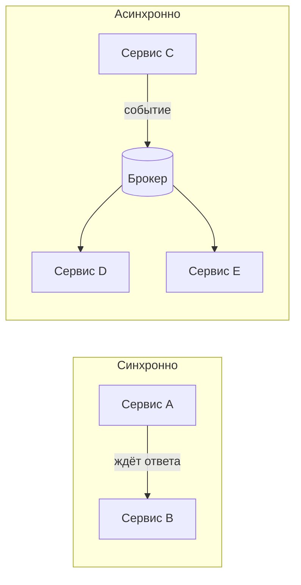

# Коммуникация сервисов

В микросервисах сервисы должны как-то находить друг друга и обмениваться данными.
Способ общения (синхронно или через очередь) сильно влияет на связанность и
устойчивость системы — это стоит понимать.

## Синхронное общение

Сервис **напрямую** зовёт другой и **ждёт ответа** — по REST или gRPC.

- **Плюс:** просто и привычно; сразу получаешь результат; естественно для
  «запрос-ответ» (получить данные пользователя).
- **Минус:** **временная связанность** — вызываемый сервис должен быть жив
  прямо сейчас. Если он лежит или тормозит, вызывающий ждёт и может сам
  деградировать. Цепочка синхронных вызовов складывает задержки и хрупкость —
  тут и нужны таймауты и circuit breaker.

## Асинхронное общение через брокер

Сервис публикует **событие/сообщение** в брокер (Kafka, RabbitMQ), а другие его
читают, когда смогут. Отправитель ответа не ждёт.

- **Плюс:** сервисы **развязаны** — получатель может быть временно недоступен,
  сообщение подождёт в брокере; отправитель не зависит от его скорости и
  доступности; легко добавить новых подписчиков, не трогая издателя.
- **Минус:** сложнее отслеживать поток; нет мгновенного ответа; появляется
  итоговая согласованность и нужна идемпотентность (сообщение может прийти дважды).

**Правило выбора:** нужен ответ здесь и сейчас (получить данные) — синхронно;
уведомить о факте / запустить обработку у других (заказ создан) — асинхронно.
Асинхронность даёт слабую связанность и устойчивость, но ценой сложности.

## Как сервисы находят друг друга

Адреса сервисов не прописывают руками — экземпляры появляются, исчезают,
масштабируются.

- **Service discovery** — реестр, где сервисы регистрируются, а другие ищут их по
  имени. Часто эту роль берёт на себя инфраструктура: в Kubernetes сервис доступен
  по имени через встроенный DNS и балансировку.
- **API Gateway** — единая точка входа для внешних клиентов: маршрутизирует
  запросы к нужным сервисам, берёт на себя аутентификацию, rate limiting, TLS.
  Клиент не знает про внутреннюю раскладку сервисов (в Spring — Spring Cloud
  Gateway).

## Service mesh (кратко)

Паттерны устойчивости (таймауты, ретраи, circuit breaker) и трейсинг можно вынести
из кода в **инфраструктуру** — sidecar-прокси рядом с каждым сервисом
перехватывает весь сетевой трафик. Такой слой называют **service mesh** (например
Istio). Для стажёра достаточно знать идею: сетевую надёжность и наблюдаемость
можно вынести из приложения в отдельный инфраструктурный слой.

## Как ответить на интервью

Коротко: сервисы общаются синхронно или асинхронно. **Синхронно** (REST/gRPC) —
зовём и ждём ответа: просто и нужно, когда результат нужен сразу, но создаёт
временную связанность — вызываемый должен быть жив, иначе ждём и деградируем,
отсюда таймауты и circuit breaker. **Асинхронно** через брокер (Kafka/RabbitMQ) —
публикуем событие, получатели читают когда смогут: сервисы развязаны, устойчивее,
легко добавлять подписчиков, но сложнее отслеживать и появляется итоговая
согласованность с идемпотентностью. Находят друг друга через **service discovery**
(в Kubernetes — по DNS-имени), а внешние клиенты ходят через **API Gateway** —
единую точку входа с маршрутизацией и аутентификацией.
