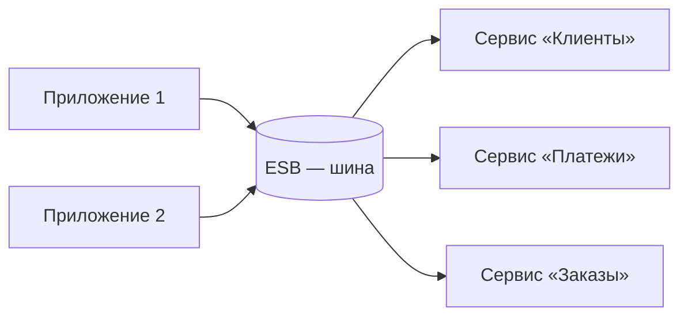

# SOA

**SOA (Service-Oriented Architecture, сервис-ориентированная архитектура)** —
подход, при котором система строится из **сервисов**, каждый из которых
предоставляет какую-то бизнес-функцию по стандартному контракту. Исторически это
**предшественник микросервисов**: на интервью SOA чаще всего всплывает именно в
сравнении с ними.

## Суть подхода

Вместо одного большого приложения — набор **переиспользуемых сервисов** (например
«Клиенты», «Платежи», «Заказы»), которые разные системы предприятия вызывают по
общему контракту. Идея — не дублировать функциональность, а один раз выставить её
сервисом и переиспользовать.

Ключевая деталь классической SOA — **ESB (Enterprise Service Bus)**,
корпоративная сервисная шина. Это центральный узел, через который идёт всё
общение: он маршрутизирует вызовы, преобразует форматы, применяет правила.
Общаются часто тяжёлыми протоколами (SOAP и стек WS-\*).

## Чем отличается от микросервисов

Микросервисы выросли из SOA, но переосмыслили её:

- **Размер сервисов:** в SOA сервисы крупные, вокруг переиспользования на весь
  бизнес; микросервисы — мелкие, каждый про одну узкую задачу.
- **Шина vs без шины:** в SOA логика (маршрутизация, преобразования) уходит в
  «умную» ESB; в микросервисах наоборот — **«умные сервисы, глупые каналы»**
  (smart endpoints, dumb pipes): логика в сервисах, а сеть — просто транспорт
  (REST, gRPC, брокер без бизнес-логики).
- **Данные:** в SOA сервисы нередко ходят в общие базы; у микросервиса —
  **своя БД**, никто в неё напрямую не лезет.
- **Протоколы:** SOA тяготеет к тяжёлому SOAP/WS-\*, микросервисы — к лёгким
  REST/gRPC и событиям.

Главный риск SOA — **ESB превращается в узкое место и единую точку отказа**: вся
логика и весь трафик сходятся в одной шине. Микросервисы сознательно от этого
ушли, распределив логику по сервисам.

## Как ответить на интервью

Коротко: SOA — сервис-ориентированная архитектура, предшественник микросервисов:
система строится из переиспользуемых сервисов с общими контрактами, а общение идёт
через центральную шину **ESB**, часто на тяжёлом SOAP. Микросервисы выросли из
этой идеи, но сделали сервисы мельче, убрали «умную» шину в пользу принципа
«умные сервисы, глупые каналы» — логика в сервисах, сеть просто транспорт, — дали
каждому свою БД и лёгкие протоколы REST/gRPC. Главная проблема классической SOA в
том, что ESB становится узким местом и единой точкой отказа, и микросервисы
сознательно от этого ушли.
