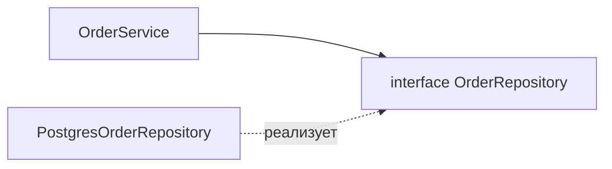

# SOLID

SOLID — пять принципов объектно-ориентированного проектирования. Все они про
одно: сделать код таким, чтобы его было **легко менять** и он не разваливался при
доработках. Идея не в том, чтобы фанатично соблюдать каждую букву, а в том, чтобы
понимать, от какой конкретной боли каждый принцип защищает.

## S — Single Responsibility (единственная ответственность)

У класса должна быть **одна причина для изменения**. Иначе говоря — один класс
отвечает за одну задачу.

- Если класс одновременно и считает цену заказа, и шлёт письмо, и пишет в базу —
  правка в логике писем задевает расчёт цены. Классы-«комбайны» страшно трогать.
- Признак нарушения: описываешь класс и в описании появляется «и»
  («сервис заказов **и** отправка уведомлений»).
- Решение — разнести по отдельным классам: `OrderService`,
  `NotificationService`, `OrderRepository`.

## O — Open/Closed (открыт для расширения, закрыт для изменения)

Поведение можно **добавлять, не переписывая** существующий код. Новую логику
подключаешь через новую реализацию, а не правкой рабочего класса.

- Классика — вместо `if (type == CARD) ... else if (type == SBP) ...` завести
  интерфейс `PaymentMethod` и добавлять новые способы оплаты как новые классы.
- Старый проверенный код не трогаешь → меньше риск сломать то, что работало.

```java
interface PaymentMethod { void pay(Money amount); }
class CardPayment implements PaymentMethod { /* ... */ }
class SbpPayment  implements PaymentMethod { /* ... */ }
// новый способ = новый класс, ветвлений не трогаем
```

## L — Liskov Substitution (подстановка Барбары Лисков)

Объект наследника должен **без сюрпризов** подставляться вместо родителя. Код,
работающий с базовым типом, не должен ломаться, получив подкласс.

- Классический антипример: `Square extends Rectangle`. У квадрата
  `setWidth` меняет и высоту — и код, ожидавший независимые стороны
  прямоугольника, начинает вести себя неверно.
- Нарушение = наследник переопределяет метод так, что тот бросает исключение или
  меняет ожидаемый контракт («квадрат — это прямоугольник» в коде не работает).

## I — Interface Segregation (разделение интерфейсов)

Лучше несколько узких интерфейсов, чем один «толстый». Клиент не должен зависеть
от методов, которые ему не нужны.

- Если интерфейс `Worker` требует `work()` **и** `eat()`, то робот-исполнитель
  вынужден реализовывать `eat()` заглушкой.
- Разбиваешь на `Workable` и `Eatable` — каждый реализует только нужное.

## D — Dependency Inversion (инверсия зависимостей)

Модули должны зависеть от **абстракций, а не от конкретных реализаций**. Высокий
уровень (бизнес-логика) не должен напрямую тащить низкий уровень (конкретную БД).

- `OrderService` зависит от интерфейса `OrderRepository`, а не от
  `PostgresOrderRepository`. Реализацию можно подменить (на тест, на другую БД),
  не трогая сервис.
- Это ровно то, на чём стоит **Dependency Injection** в Spring: бину дают
  зависимость по интерфейсу, а какую именно реализацию — решает контейнер.



## Зачем это на самом деле

Все пять принципов служат одной цели — **слабая связанность и высокая
связность**: части системы мало знают друг о друге и каждая занята своим делом.
Такой код проще читать, тестировать (можно подменять зависимости моками) и
менять по частям.

Обратная сторона — не надо доводить до абсурда. Плодить интерфейсы и слои «на
всякий случай» там, где логика простая и одна, — это лишняя сложность, а не
хорошее проектирование.

## Как ответить на интервью

Коротко: SOLID — пять принципов ООП-проектирования ради кода, который легко
менять. **S** — один класс, одна ответственность. **O** — поведение добавляем
новыми классами, не переписывая старые (через интерфейсы). **L** — наследник
подставляется вместо родителя без сюрпризов и не ломает контракт. **I** — узкие
интерфейсы вместо толстых, клиент не зависит от лишних методов. **D** — зависим
от абстракций, а не от реализаций; на этом стоит DI в Spring. Общий смысл —
слабая связанность и высокая связность, но без фанатизма: лишние слои ради
«правильности» только усложняют.
