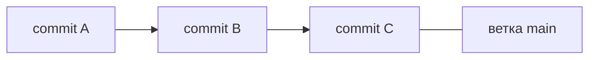
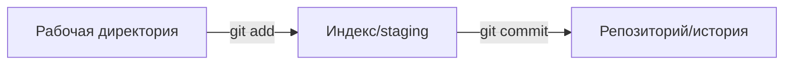

# Как устроен Git

Git — распределённая система контроля версий. «Распределённая» — потому что у
каждого разработчика **полная копия** истории проекта, а не только последняя
версия. Понимание базовой модели снимает большинство вопросов «а что тут
происходит».

## Что Git хранит

Git хранит **снимки** (snapshots) состояния проекта, а не разницы между файлами.
Каждый **коммит** — это снимок всех файлов на момент фиксации плюс ссылка на
родительский коммит. Из этих ссылок складывается история.

- У коммита есть: идентификатор (хеш), автор, сообщение, ссылка на родителя.
- История — это цепочка коммитов, связанных ссылками «родитель».

## Три состояния файла

Ключевая модель Git — файл проходит через три «зоны»:

1. **Рабочая директория (working directory)** — файлы, которые ты редактируешь.
2. **Индекс / staging area** — что попадёт в следующий коммит. Сюда добавляют
   через `git add`.
3. **Репозиторий** — зафиксированная история. Сюда попадает по `git commit`.

Staging area — важная особенность Git: можно набрать в коммит **не все**
изменения, а выбранные, собрав осмысленный атомарный коммит.

## Ветки

**Ветка** — это просто **подвижный указатель** на коммит. Создать ветку дёшево —
это новая метка, а не копия файлов. `main` — обычная ветка, ничем технически не
особенная.

- Делаешь коммит — указатель ветки сдвигается на новый коммит.
- `HEAD` — указатель на то, где ты сейчас (на какой ветке/коммите).

Дешевизна веток — причина, почему в Git принято работать в ветках под каждую
задачу.

## Локально и удалённо

Git распределённый: есть **локальный** репозиторий (у тебя) и **удалённый**
(remote, обычно на GitHub, зовётся `origin`). Они синхронизируются вручную:

- `git push` — отправить свои коммиты в удалённый.
- `git pull` — забрать чужие коммиты из удалённого (это `fetch` + слияние).

Пока не сделал `push`, твои коммиты живут только у тебя — это нормально.

## Как ответить на интервью

Коротко: Git — распределённая система, у каждого полная копия истории. Хранит
снимки состояния проекта: коммит — снимок файлов плюс ссылка на родителя, из
ссылок складывается история. Файл проходит три зоны: рабочая директория →
индекс (`git add`) → репозиторий (`git commit`); staging позволяет собрать в
коммит только нужные изменения. Ветка — это подвижный указатель на коммит,
создавать её дёшево, поэтому работают в ветках под задачу; `HEAD` — где ты сейчас.
Локальный и удалённый (`origin`) репозитории синхронишь вручную через `push` и
`pull`.
