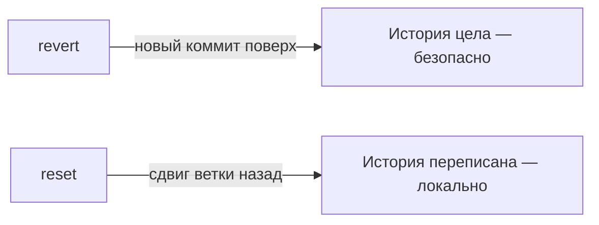

# Когда всё сломалось

Отдельная страница про «спасательные» команды. Их редко используешь, но в нужный
момент они выручают, а на интервью любят спросить «а как откатить/отменить».
Главное — понимать разницу между командами, которые **безопасны**, и теми, что
**переписывают историю**.

## Отменить изменения

- **Изменения в файле ещё не в staging** — `git restore <файл>` вернёт файл к
  последнему коммиту (правки пропадут).
- **Уже сделал `git add`, но не коммитил** — `git restore --staged <файл>` уберёт
  из индекса (сами правки останутся).

## Отменить коммит

- **`git revert <коммит>`** — создаёт **новый** коммит, отменяющий изменения
  указанного. История сохраняется. **Безопасно** для уже запушенных коммитов —
  ими можно отменять чужой/общий код.
- **`git reset`** — сдвигает ветку назад, «убирая» коммиты из истории. Варианты:
    - `--soft` — коммиты убраны, изменения остаются в staging;
    - `--mixed` (по умолчанию) — изменения остаются в рабочей директории;
    - `--hard` — **изменения удаляются совсем**. Опасно: несохранённое пропадёт.

**Ключевое различие:** `revert` — безопасная отмена новым коммитом (для общей
истории), `reset` — переписывание истории (только для локальных, не запушенных
коммитов).

## Отложить незаконченное

`git stash` — временно спрятать незакоммиченные изменения, чтобы, например, срочно
переключиться на другую ветку. `git stash pop` — вернуть их обратно. Удобно, когда
надо быстро отвлечься, не делая «мусорный» коммит.

## Спасательный круг — reflog

`git reflog` — журнал, куда Git пишет **все** перемещения `HEAD` (коммиты,
переключения, сбросы). Даже если сделал `reset --hard` и «потерял» коммиты, их хеши
остаются в reflog, и можно вернуться: `git reset --hard <хеш из reflog>`.

Вывод: в Git **почти ничего не теряется безвозвратно**, пока коммит был создан —
reflog помнит. Это снимает страх экспериментировать.

## Как ответить на интервью

Коротко: правки в файле откатываю `git restore`, из staging убираю
`git restore --staged`. Для отмены коммита разделяю два случая: **`git revert`**
делает новый коммит, отменяющий изменения, — безопасно для уже запушенной общей
истории; **`git reset`** сдвигает ветку назад и переписывает историю (с `--hard`
теряя изменения) — только для локальных, ещё не запушенных коммитов. Незаконченное
прячу через `git stash`. И главный спасательный круг — **`git reflog`**: он помнит
все перемещения `HEAD`, поэтому даже после `reset --hard` потерянный коммит можно
вернуть по хешу. В Git почти ничего не пропадает безвозвратно.
