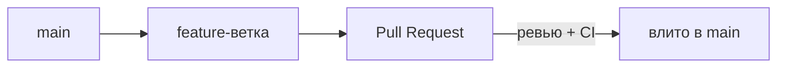

# Командные процессы

В команде Git — это не только личные коммиты, а согласованный процесс: как вливать
работу, чтобы `main` оставался стабильным и история была читаемой. Разберём то,
что реально встречается на работе.

## Feature branch + Pull Request

Самый распространённый процесс:

1. От `main` создаёшь ветку под задачу (`feature/...`).
2. Работаешь, коммитишь в неё, пушишь.
3. Открываешь **Pull Request** (на GitLab — Merge Request) — предложение влить
   ветку в `main`.
4. Коллеги делают **код-ревью**, CI прогоняет тесты и сборку.
5. После одобрения ветку вливают в `main`, ветку удаляют.

Смысл — в `main` попадает только проверенный код: прошедший ревью и CI. Сам `main`
напрямую не трогают.

## Merge, squash или rebase

Три способа влить ветку — их часто спрашивают:

- **Merge commit** — создаёт отдельный коммит слияния, сохраняет всю историю
  ветки как есть. История полная, но с «развилками».
- **Squash** — все коммиты ветки схлопываются в **один** при вливании. История
  `main` чистая: одна задача — один коммит. Частый выбор.
- **Rebase** — переносит коммиты ветки поверх свежего `main`, история становится
  **линейной**, без коммитов слияния.

## Merge vs rebase — суть

- **Merge** сохраняет историю как было и безопасен, но плодит коммиты слияния.
- **Rebase** переписывает коммиты (даёт им новые хеши) ради линейной, чистой
  истории.

Золотое правило: **не делать rebase уже опубликованных (запушенных, общих)
коммитов** — ты перепишешь историю, которая есть у других, и всё разъедется.
Rebase — для своей локальной, ещё не расшаренной ветки.

## Что почитать в истории

- `git log --oneline --graph` — увидеть структуру веток и слияний.
- `git blame <файл>` — кто и в каком коммите менял конкретную строку (полезно,
  чтобы понять, зачем что-то сделано).

## Как ответить на интервью

Коротко: в команде работаю через **feature branch + Pull Request**. Ветка от
`main` под задачу, коммиты, PR, код-ревью и CI, и только после одобрения вливание
в `main` — сам `main` напрямую не трогаем, туда идёт только проверенный код. Влить
можно тремя способами: **merge** (коммит слияния, полная история), **squash** (вся
ветка в один коммит, чистый `main`) или **rebase** (линейная история без слияний).
Merge безопасен и сохраняет историю, rebase её переписывает ради линейности —
поэтому rebase делаю только на своей неопубликованной ветке, общие запушенные
коммиты не переписываю.
