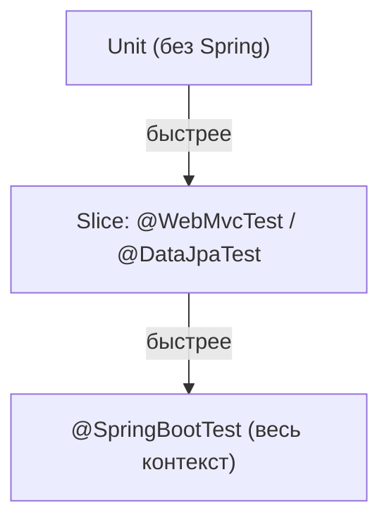

# Тестирование Spring-приложений

Spring-приложение можно тестировать на разных уровнях: от чистого unit без Spring
вообще до подъёма всего контекста. Важно выбирать **минимально нужный** уровень —
чем больше поднимаешь, тем медленнее тест.

## Уровень 1 — без Spring вообще

Сервис с логикой лучше тестировать как обычный класс: создать `new`, подставить
моки зависимостей, проверить логику. **Spring-контекст поднимать не нужно** — это
быстрее всего и покрывает большую часть бизнес-логики. Правило: если можно без
Spring — тестируй без Spring.

## Уровень 2 — срезы контекста (slice-тесты)

Когда нужно проверить взаимодействие со Spring, но не всё приложение, поднимают
**часть** контекста:

- **`@WebMvcTest`** — поднимает только web-слой (контроллеры, сериализацию,
  валидацию), без сервисов и БД. Сервисы подменяют `@MockBean`. Запросы шлют через
  `MockMvc`. Проверяет маппинг, коды ответов, JSON.
- **`@DataJpaTest`** — поднимает только JPA-слой (репозитории, EntityManager) с
  тестовой БД. Проверяет запросы и маппинг сущностей.

Срезы поднимают немного бинов → быстрее полного контекста.



## Уровень 3 — полный контекст

**`@SpringBootTest`** поднимает **всё приложение**. Нужен для полноценных
интеграционных тестов, где важно, как всё работает вместе. Самый медленный —
применять точечно, а не для каждого теста.

## Ключевые инструменты

- **`MockMvc`** — шлёт HTTP-запросы к контроллерам без реального сервера,
  проверяет статус, заголовки, тело:
  ```java
  mockMvc.perform(get("/orders/1"))
         .andExpect(status().isOk())
         .andExpect(jsonPath("$.id").value(1));
  ```
- **`@MockBean`** — заменяет бин в контексте моком (в отличие от `@Mock`, это про
  Spring-контекст). Так подменяют сервис в `@WebMvcTest` или внешний клиент.
- **`@TestConfiguration`** — отдельная конфигурация с тестовыми бинами.

## Про базу в тестах

Для `@DataJpaTest` часто берут встроенную H2 — быстро, но её диалект **отличается**
от боевого PostgreSQL, и часть вещей ведёт себя иначе. Чтобы тестировать на **той
же** СУБД, что в проде, используют Testcontainers — поднимают настоящий Postgres в
контейнере.

## Как ответить на интервью

Коротко: тестирую на минимально нужном уровне. Логику сервисов — как обычные
классы с моками, **без Spring**, это быстрее всего. Нужен кусок Spring — беру
**срезы**: `@WebMvcTest` для web-слоя с `MockMvc` и `@MockBean` вместо сервисов,
`@DataJpaTest` для репозиториев с тестовой БД. Полное приложение — `@SpringBootTest`,
но он медленный, применяю точечно для интеграционных тестов. Для подмены бина в
контексте — `@MockBean`. H2 в тестах быстрая, но её диалект отличается от Postgres,
поэтому честнее поднимать настоящую БД через Testcontainers.
