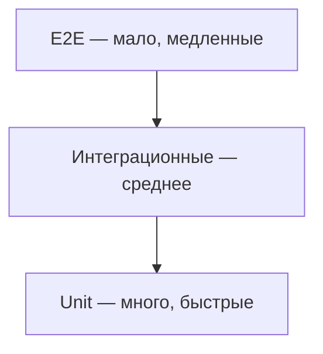

# Виды тестов и пирамида

Тесты нужны, чтобы менять код без страха: после правки прогоняешь тесты и видишь,
не сломалось ли то, что работало. Виды тестов различают по тому, **что и на каком
уровне** они проверяют — от одного метода до системы целиком.

## Основные виды

- **Модульные (unit)** — проверяют один класс/метод **в изоляции**, без БД, сети
  и Spring-контекста. Зависимости подменяются моками. Быстрые (миллисекунды),
  их много. Основная масса тестов.
- **Интеграционные (integration)** — проверяют, что компоненты работают **вместе
  и с внешними системами**: сервис + реальная БД, репозиторий + Postgres. Медленнее,
  их меньше. В Java для честной БД — Testcontainers.
- **Сквозные (E2E)** — проверяют систему целиком, как её видит пользователь, через
  реальный ввод. Самые медленные и хрупкие, их совсем мало. Для backend-стажёра
  писать их обычно не требуется — достаточно понимать, что это и зачем.

## Пирамида тестирования

Правило о том, **сколько каких** тестов держать: много быстрых unit внизу, меньше
интеграционных в середине, совсем мало E2E сверху.

Логика: чем ниже уровень, тем тест быстрее, стабильнее и точнее показывает, **где**
сломалось. Если перевернуть пирамиду (много медленных E2E, мало unit) — прогон
долгий, тесты хрупкие, а падение не подсказывает причину. Это антипаттерн
«мороженое» (перевёрнутая пирамида).

## Зачем вообще тесты

- **Защита от регрессий** — правишь код, тесты ловят непреднамеренные поломки.
- **Документация поведения** — тест показывает, как класс должен работать.
- **Давление на дизайн** — код, который тяжело протестировать (всё связано,
  зависимости зашиты жёстко), обычно плохо спроектирован. Тестируемость толкает к
  слабой связанности и DI.

## Немного про TDD

**TDD** (test-driven development) — сначала пишешь падающий тест, потом код, чтобы
он прошёл, потом рефакторишь. Помогает продумать поведение заранее и держать
тестируемость высокой. Знать подход полезно; применять его повсеместно
необязательно.

## Как ответить на интервью

Коротко: тесты делю по уровню. **Unit** — один класс в изоляции, зависимости
замоканы, быстрые, их большинство. **Интеграционные** — компоненты вместе с
реальными внешними системами, например сервис с настоящей БД через Testcontainers,
их меньше. **E2E** — вся система глазами пользователя, медленные и хрупкие, их
совсем мало. Это и есть **пирамида тестирования**: много быстрых unit внизу, мало
E2E сверху; перевёрнутая пирамида — антипаттерн, долгий и хрупкий прогон. Тесты
дают защиту от регрессий, документируют поведение и давят на хороший дизайн: что
трудно протестировать — то плохо спроектировано.
