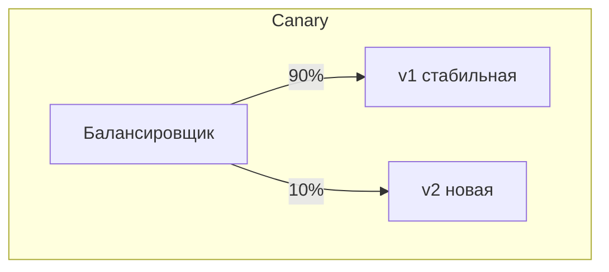

# Выкатка

Последний этап пайплайна — **деплой**: новая версия приложения выкатывается на сервер.
Главная задача здесь — обновиться **без простоя** и с возможностью быстро откатиться,
если что-то пошло не так. Junior-у достаточно понимать основные стратегии выкатки на
уровне идеи — их часто спрашивают обзорно.

## Проблема: обновление без простоя

Наивный вариант — «погасить старую версию, поднять новую» — даёт **простой**: пока новая
поднимается, сервис недоступен. В проде так нельзя. Поэтому используют стратегии, которые
обновляют аккуратно, держа сервис живым.

## Стратегии выкатки

**Rolling update (по одному)** — заменяют экземпляры постепенно: подняли новую копию,
убедились, что здорова, погасили старую, перешли к следующей. Пока идёт обновление, часть
копий старой версии, часть — новой, но сервис всё время доступен. Это **стратегия по
умолчанию в Kubernetes**.

**Blue-green** — держат два одинаковых окружения: «синее» (текущее) и «зелёное» (новая
версия). Новую версию полностью разворачивают и проверяют на зелёном, затем **разом
переключают трафик** на него. Откат мгновенный — вернуть трафик на синее. Минус — нужно
двойное количество ресурсов.

**Canary (канареечный)** — новую версию выпускают **на маленькую долю трафика** (5–10%),
следят за метриками и ошибками; если всё хорошо — постепенно наращивают до 100%, если нет
— откатывают, зацепив лишь малую часть пользователей. Самый безопасный, но сложнее в
организации (нужны метрики и управление трафиком).

## Откат (rollback)

Что-то пошло не так после выкатки — нужно быстро вернуть предыдущую рабочую версию.
Поскольку разворачивают **неизменяемые образы** с версиями-тегами, откат — это просто
выкатка предыдущего образа. В Kubernetes для этого есть встроенный механизм отката
Deployment на прошлую ревизию. Возможность быстро откатиться важнее, чем идеальная
выкатка: ошибаются все, вопрос — как быстро починить.

## Окружения

Версия обычно едет по цепочке окружений, а не сразу на прод:

- **dev** — для разработки, нестабильно;
- **stage/test** — приближено к проду, там прогоняют перед релизом;
- **prod** — боевое, с реальными пользователями.

Одна и та же сборка (тот же Docker-образ) проходит все окружения, меняется только
конфигурация — это гарантирует, что на прод едет ровно то, что проверяли.

## Как ответить на интервью

Коротко: деплой — финальный этап пайплайна, и главная задача обновиться без простоя и с
возможностью отката. Наивное «погасить старое, поднять новое» даёт простой, поэтому есть
стратегии. **Rolling update** — заменять экземпляры постепенно, сервис всё время живой,
это дефолт в Kubernetes. **Blue-green** — два окружения, новую версию разворачивают
рядом и разом переключают трафик, откат мгновенный, но нужно вдвое больше ресурсов.
**Canary** — выпустить новую версию на малую долю трафика, последить за метриками и
постепенно нарастить, самый безопасный. Откат работает просто, потому что образы
неизменяемые с версиями-тегами — откатиться значит выкатить предыдущий образ. И версия
едет по окружениям dev → stage → prod одним и тем же образом, меняется только конфиг —
так на прод попадает ровно то, что проверяли. Глубоко деплоем я не занимался, но
стратегии и зачем они — понимаю.
