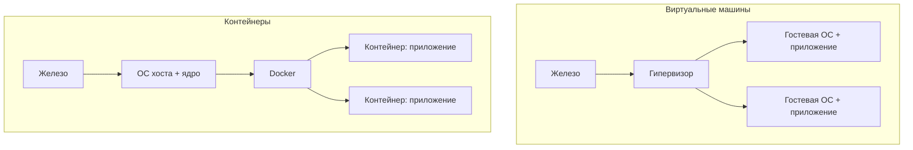

# Контейнеры и образы

Docker — инструмент, который упаковывает приложение вместе со всем его окружением
(JDK, библиотеки, системные пакеты) в изолированную единицу — **контейнер**.
Идея простая: «у меня на машине работает, а на сервере нет» перестаёт быть
проблемой, потому что приложение едет вместе со своим окружением.

## Контейнер и виртуальная машина

Оба дают изоляцию, но по-разному:

- **Виртуальная машина** — эмулирует целый компьютер: поверх хостовой ОС работает
  гипервизор, а в нём — полноценная гостевая ОС со своим ядром. Тяжело: гигабайты,
  запуск десятками секунд.
- **Контейнер** — не своя ОС, а изолированный процесс на **ядре хоста**. Изоляция
  делается средствами самого Linux (namespaces — изоляция того, что процесс видит;
  cgroups — ограничение ресурсов). Легко: мегабайты, запуск за доли секунды.



Контейнер не тащит с собой ядро и целую ОС, поэтому его и можно запускать пачками
на одной машине — на этом и построены микросервисы и Kubernetes.

## Образ и контейнер

Ключевое различие, которое любят спрашивать:

- **Образ (image)** — неизменяемый шаблон: файловая система с приложением и
  зависимостями плюс инструкция, что запускать. Это как класс.
- **Контейнер (container)** — запущенный экземпляр образа, живой процесс. Это как
  объект. Из одного образа можно поднять сколько угодно контейнеров.

Аналогия «класс → объект» — самая точная и понятная на интервью.

## Слои образа

Образ состоит из **слоёв (layers)**, наложенных друг на друга. Каждая инструкция
сборки добавляет новый слой поверх предыдущего:

- слои **переиспользуются и кешируются** — если базовый слой с JDK уже скачан, для
  другого образа он не качается заново;
- слои **только для чтения**, а контейнер сверху добавляет тонкий **writable-слой**
  для своих изменений во время работы;
- благодаря этому образы занимают меньше места на диске, чем кажется: общие слои
  хранятся один раз.

Отсюда практическое следствие: порядок инструкций в сборке влияет на скорость —
об этом на странице про [Dockerfile](dockerfile.md).

## Реестр (registry)

Образы хранятся и раздаются через **реестр**:

- **Docker Hub** — публичный реестр по умолчанию (там лежат официальные образы
  `postgres`, `openjdk`, `nginx` и т.д.);
- у компаний обычно **приватный реестр** (Harbor, Nexus, GitLab Registry) для своих
  образов.

Основные операции: `docker pull` (скачать образ), `docker push` (загрузить свой),
`docker build` (собрать образ из Dockerfile).

## Базовые команды

```bash
docker pull postgres:16        # скачать образ
docker images                  # список локальных образов
docker run postgres:16         # создать и запустить контейнер
docker ps                      # запущенные контейнеры
docker ps -a                   # все, включая остановленные
docker stop <id> / docker rm <id>   # остановить / удалить
docker logs <id>               # логи контейнера
docker exec -it <id> bash      # зайти внутрь работающего контейнера
```

## Как ответить на интервью

Коротко: Docker упаковывает приложение вместе с окружением в контейнер, чтобы оно
одинаково работало везде. Контейнер — это не виртуальная машина: он не тащит
гостевую ОС, а работает как изолированный процесс на ядре хоста (изоляция через
namespaces, ограничение ресурсов через cgroups), поэтому лёгкий и стартует мгновенно.
Ключевое различие: **образ** — неизменяемый шаблон (как класс), **контейнер** —
запущенный экземпляр образа (как объект). Образ состоит из слоёв, которые кешируются
и переиспользуются между образами. Хранятся образы в реестре — публичном Docker Hub
или приватном компанийском. Для меня это в первую очередь способ одной командой
поднять локально Postgres, Kafka, Redis и запускать своё приложение одинаково
локально и на сервере.
