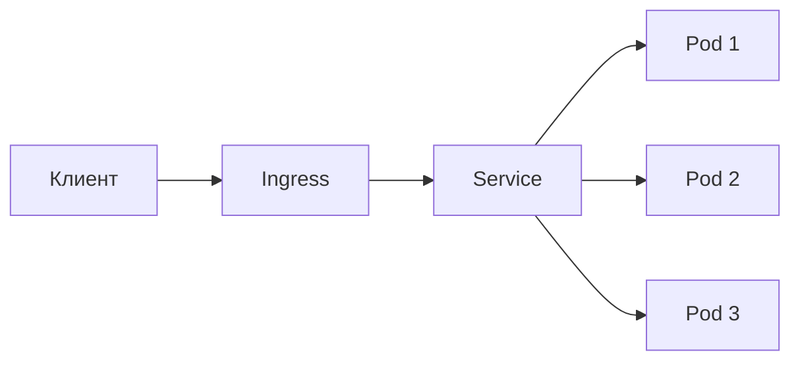

# Приложение в кластере

Собрав картину из объектов, полезно понять, что нужно **от самого приложения**, чтобы
оно нормально жило в Kubernetes. Это как раз зона ответственности разработчика, а не
администратора кластера. Ключевых требований немного: пробы здоровья, конфигурация
снаружи, корректное завершение и разумные лимиты ресурсов.

## Путь запроса снаружи внутрь

Запрос из интернета попадает на Ingress, тот отдаёт его нужному Service, а Service
балансирует между подами Deployment. Приложению об этом знать не надо — оно просто
слушает свой порт.

## Пробы здоровья (probes)

Kubernetes должен понимать состояние приложения, чтобы правильно им управлять. Для
этого приложение отдаёт HTTP-эндпоинты здоровья, которые кластер периодически опрашивает:

- **liveness** — «жив ли процесс?». Если проба не отвечает, под считается зависшим и
  **перезапускается**.
- **readiness** — «готов ли принимать трафик?». Пока проба не ОК, под есть, но Service
  **не шлёт** на него запросы. Нужно, чтобы не отправлять трафик в приложение, которое
  ещё поднимается или прогревает соединения.

В Spring Boot это закрывается **Spring Boot Actuator**: он из коробки даёт
`/actuator/health` с liveness/readiness-группами. Это прямая связка бэкенда с
Kubernetes.

## Конфигурация снаружи

Приложение не должно хранить настройки и секреты внутри образа — они приходят из
ConfigMap/Secret как переменные окружения. Spring Boot удобно читает их: переменная
`SPRING_DATASOURCE_URL` переопределяет `spring.datasource.url`. Так один образ едет в
dev/stage/prod без пересборки — меняется только конфигурация в кластере.

## Корректное завершение (graceful shutdown)

При обновлении или масштабировании Kubernetes гасит поды. Он посылает процессу сигнал
`SIGTERM` и даёт время завершиться, прежде чем убить принудительно. Приложение должно
за это время **доработать текущие запросы** и закрыть ресурсы, а не оборваться на
полуслове. Spring Boot умеет graceful shutdown — дообрабатывает активные запросы и
только потом останавливается. Иначе при каждом деплое часть запросов будет падать.

## Ресурсы: requests и limits

Каждому контейнеру задают ресурсы:

- **requests** — сколько CPU/памяти гарантированно нужно; по этому числу кластер решает,
  на какой узел поместить под;
- **limits** — потолок; при превышении памяти под убивают (**OOMKilled**), CPU —
  придушивают (throttling).

Для Java это тонкий момент: важно, чтобы **heap JVM** был согласован с limit памяти
контейнера. Современные JVM учитывают лимиты контейнера автоматически, но если задать
heap больше лимита — под будет регулярно падать с OOMKilled.

## Как ответить на интервью

Коротко: со стороны разработчика приложение должно нормально жить в кластере, и это
несколько вещей. Первое — **пробы здоровья**: liveness («жив ли процесс», иначе
перезапуск) и readiness («готов ли принимать трафик», иначе Service не шлёт запросы); в
Spring это из коробки даёт Actuator через `/actuator/health`. Второе — **конфигурация
снаружи** через ConfigMap/Secret как переменные окружения, Spring Boot их подхватывает,
так один образ едет во все окружения. Третье — **graceful shutdown**: по `SIGTERM`
дообработать текущие запросы, а не оборваться, иначе деплой роняет часть трафика — Spring
Boot это умеет. И четвёртое — **requests/limits** на ресурсы; для Java важно, чтобы heap
JVM был согласован с лимитом памяти, иначе под ловит OOMKilled. Сам кластер я не
администрировал, но что требуется от приложения — понимаю.
