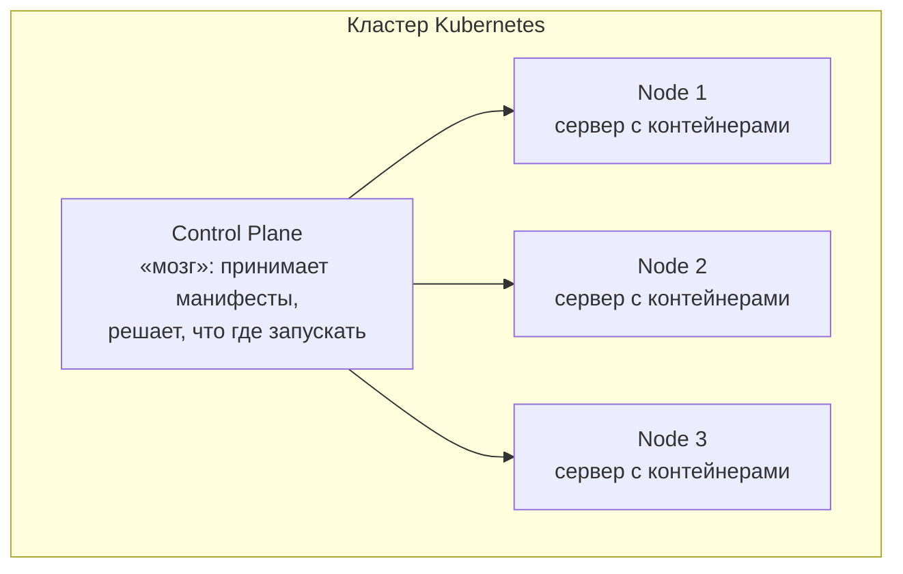

# Зачем нужен Kubernetes

Docker умеет запускать контейнеры на одной машине. Но в проде их десятки и сотни на
множестве серверов, и кто-то должен всем этим управлять: раскидывать контейнеры по
машинам, перезапускать упавшие, масштабировать под нагрузку, обновлять без простоя.
**Kubernetes (K8s)** — это оркестратор контейнеров, который делает всё перечисленное
автоматически. Для junior-разработчика важно понимать, *что он даёт и как в нём живёт
приложение*, а не уметь администрировать кластер.

## Какие проблемы решает

Если бы контейнерами управляли вручную, пришлось бы самому:

- решать, **на какой сервер** поставить новый контейнер, чтобы хватило ресурсов;
- **перезапускать** упавшие контейнеры и уводить их с умерших серверов;
- **масштабировать** — поднимать больше копий под нагрузкой и убирать лишние;
- **обновлять** версию без остановки сервиса;
- давать сервисам **находить друг друга** и балансировать между копиями.

Kubernetes берёт это на себя. Разработчик описывает **желаемое состояние** («хочу 3
копии этого образа»), а кластер сам приводит систему к нему и поддерживает.

## Декларативность — ключевая идея

Главный принцип: ты не командуешь по шагам («запусти контейнер», «теперь ещё один»),
а **описываешь целевое состояние** в YAML-манифесте. Kubernetes постоянно сравнивает
фактическое состояние с желаемым и устраняет расхождение — это называется
**reconciliation loop**.

- Упал контейнер — фактических копий стало 2 вместо 3 → кластер поднимает новую.
- Умер целый сервер — его контейнеры уезжают на другие узлы.
- Попросили 5 копий вместо 3 — кластер добавляет две.

Ты говоришь «что должно быть», а не «что сделать». Это и отличает оркестратор от
ручного запуска.

## Из чего состоит кластер (обзорно)

- **Node (узел)** — сервер (физический или виртуальный), на котором реально крутятся
  контейнеры.
- **Control Plane** — управляющий слой: принимает манифесты, решает, куда что
  поставить, следит за состоянием. Условный «мозг» кластера.

Глубоко в компоненты control plane (API-сервер, scheduler, etcd) junior-у лезть не
нужно — достаточно понимать это разделение.

## Как ответить на интервью

Коротко: Docker запускает контейнеры на одной машине, а в проде их сотни на множестве
серверов — Kubernetes это оркестратор, который управляет ими автоматически: раскидывает
по серверам, перезапускает упавшие, масштабирует под нагрузку, обновляет без простоя,
даёт сервис-дискавери и балансировку. Главная идея — **декларативность**: я не командую
по шагам, а описываю желаемое состояние в YAML («хочу 3 копии этого образа»), а кластер
сам постоянно приводит фактическое состояние к желаемому. Кластер — это узлы (серверы с
контейнерами) и control plane (мозг, который решает, что где запускать). Глубоко я
кластер не администрировал — на уровне разработчика мне важно понимать, как в нём живёт
и настраивается моё приложение.
