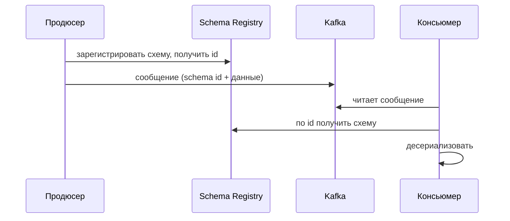

# Schema Registry

Schema Registry — отдельный сервис, который **централизованно хранит схемы**
сообщений и следит за их совместимостью. Он снимает проблему «как продюсер и
консьюмеры договариваются о схеме и её версиях».

## Зачем

Если возить полную схему в каждом сообщении — дорого; если держать её только в
коде — легко разойтись версиями. Registry — единый источник правды: схемы
лежат в нём, а в сообщении передаётся лишь маленький **id схемы**.

## Как работает с Kafka

1. Продюсер регистрирует схему в Registry, получает **id**.
2. В сообщение кладётся id схемы + бинарные данные (не вся схема).
3. Консьюмер по id **запрашивает** схему из Registry (и кэширует) и
   десериализует.

## Проверка совместимости

Главная ценность: при регистрации новой версии схемы Registry **проверяет
совместимость** с предыдущими по заданной политике (backward/forward/full).
Несовместимое изменение он **отклоняет** — сломать консьюмеров становится
трудно ещё на этапе публикации схемы.

- **Backward** — новые консьюмеры читают старые данные.
- **Forward** — старые консьюмеры читают новые данные.
- **Full** — оба направления.

!!! note "Честно про опыт"
    В проде не настраивал — разбирал и пробовал на пет-проекте. Уверенно про
    модель (id схемы в сообщении, проверка совместимости), не про эксплуатацию.

## Как ответить на интервью

Коротко: Schema Registry — сервис, который централизованно хранит схемы и
проверяет их совместимость. В сообщение кладётся не вся схема, а её id;
консьюмер по id забирает схему из Registry и кэширует — так экономятся байты и
все работают с согласованными версиями. Главная польза — при публикации новой
версии Registry сверяет совместимость по политике (backward/forward/full) и
отклоняет ломающее изменение, поэтому продюсер не может незаметно сломать
консьюмеров. Типичная связка — Kafka + Avro + Schema Registry.
