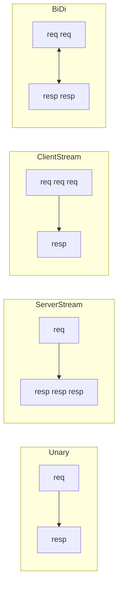

# Виды вызовов

Одно из главных отличий gRPC от обычного REST — нативный **стриминг** поверх
HTTP/2. Есть четыре вида вызовов, различающихся тем, одно сообщение или поток
идёт с каждой стороны.

## Четыре вида

- **Unary (унарный)** — один запрос → один ответ. Обычный вызов, как REST-эндпоинт.
  `rpc GetUser(Request) returns (User)`.
- **Server streaming** — один запрос → **поток** ответов. Сервер шлёт серию
  сообщений (лента событий, подписка на обновления).
  `rpc Subscribe(Request) returns (stream Event)`.
- **Client streaming** — **поток** запросов → один ответ. Клиент шлёт много
  сообщений, сервер отвечает итогом (загрузка потока данных).
  `rpc Upload(stream Chunk) returns (Result)`.
- **Bidirectional streaming** — два независимых потока навстречу. Обе стороны
  шлют сообщения асинхронно (чат, интерактивная сессия).
  `rpc Chat(stream Msg) returns (stream Msg)`.

## Почему это возможно

Стриминг держится на **HTTP/2**: одно соединение мультиплексирует потоки, и
сообщения можно слать в обе стороны в рамках одного вызова, не открывая новых
соединений. В HTTP/1.1 такого нативно нет.

## Когда что брать

- Обычный запрос-ответ — **unary** (по умолчанию).
- Сервер шлёт события клиенту — **server streaming** (альтернатива SSE внутри
  системы).
- Двусторонний интерактив — **bidirectional** (аналог WebSocket, но с
  контрактом и Protobuf).

## Как ответить на интервью

Коротко: gRPC поверх HTTP/2 поддерживает четыре вида вызовов. Unary — обычный
один-запрос-один-ответ. Server streaming — один запрос, поток ответов (лента
событий). Client streaming — поток запросов, один ответ (загрузка данных).
Bidirectional — два встречных потока (чат, интерактив). Всё это работает
благодаря мультиплексированию HTTP/2, чего нет в HTTP/1.1. Грубо говоря, server
streaming закрывает нишу SSE, а bidirectional — WebSocket, но со строгим
контрактом.
