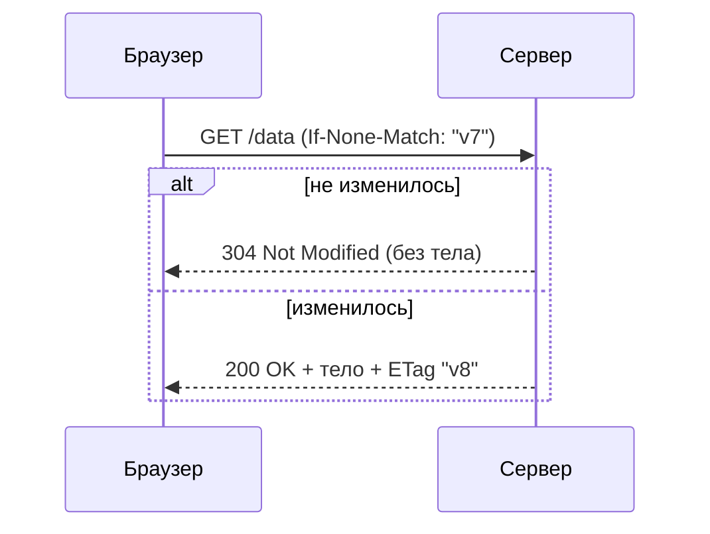

# Кэширование в HTTP

Кэширование позволяет не запрашивать/не пересчитывать то, что не изменилось:
браузер и промежуточные прокси/CDN хранят ответы и переиспользуют их. Управляют
этим заголовки.

## Два вида кэша

- **Свежесть (freshness)** — ответ можно брать из кэша **без обращения к
  серверу**, пока не истёк срок.
- **Валидация (validation)** — срок истёк, клиент спрашивает сервер «не
  изменилось ли?»; если нет — сервер отвечает `304 Not Modified` без тела
  (экономит трафик).

## `Cache-Control` — основной заголовок

- **`max-age=3600`** — сколько секунд ответ считается свежим.
- **`no-cache`** — кэшировать можно, но перед использованием **валидировать**
  на сервере.
- **`no-store`** — не кэшировать вообще (чувствительные данные).
- **`private`** — кэшировать только в браузере, не в общих прокси/CDN.
- **`public`** — можно и в общих кэшах.

## Валидаторы: ETag и Last-Modified

- **`ETag`** — «отпечаток» версии ресурса. Клиент при следующем запросе шлёт
  `If-None-Match: <etag>`; совпало — `304`, нет — новый ответ.
- **`Last-Modified`** — дата изменения; клиент шлёт `If-Modified-Since`.

## Где живёт кэш

- **Браузер** — приватный кэш пользователя.
- **CDN / обратный прокси** — общий кэш перед сервером, снимает нагрузку и
  ускоряет отдачу статики близко к пользователю.

## Как ответить на интервью

Коротко: HTTP-кэш экономит запросы. Есть свежесть (пока не истёк `max-age`,
берём из кэша без сервера) и валидация (истекло — спрашиваем сервер, и если не
изменилось, он отвечает `304` без тела). Главный заголовок — `Cache-Control`
(`max-age`, `no-cache` = валидировать, `no-store` = не кэшировать, `private`
против CDN). Версию ресурса сверяют через `ETag` (+`If-None-Match`) или
`Last-Modified`. Кэш живёт в браузере и в общих CDN/прокси перед сервером.
