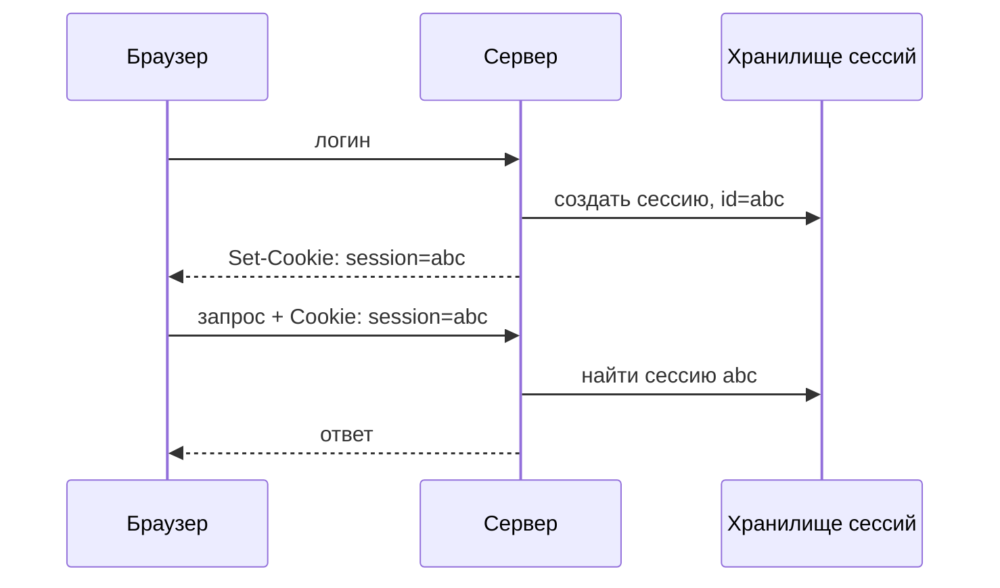

# Куки и сессии

HTTP без состояния, поэтому «узнавание» пользователя между запросами строят
на **куках** — небольших данных, которые сервер просит браузер хранить и
слать обратно. На куках держатся два подхода: серверная **сессия** и
самодостаточный **токен**.

## Как работают куки

1. Сервер в ответе шлёт `Set-Cookie: session=abc123`.
2. Браузер сохраняет и на каждый следующий запрос к этому домену добавляет
   `Cookie: session=abc123`.
3. Сервер по значению узнаёт клиента.

## Сессия (server-side)

Классическая схема: в куке лежит только **идентификатор сессии**, а сами
данные (кто вошёл, роли) — на сервере (в памяти, Redis, БД).

- Плюс: сессию можно мгновенно **отозвать** (удалить на сервере).
- Минус: нужно **общее хранилище** сессий, иначе при нескольких инстансах
  пользователя «выкидывает» (поэтому сессии часто держат в Redis, а не в памяти).

## Токен (stateless, например JWT)

Все данные о пользователе лежат в **самом токене**, подписанном сервером.
Сервер ничего не хранит — проверяет подпись и доверяет содержимому.

- Плюс: масштабируется без общего хранилища, любой инстанс проверит подпись.
- Минус: **отозвать сложно** (токен валиден до истечения) — лечат коротким
  сроком жизни + refresh-токен или чёрным списком.

## Атрибуты куки (безопасность)

- **`HttpOnly`** — кука недоступна из JavaScript (защита от XSS-кражи).
- **`Secure`** — шлётся только по HTTPS.
- **`SameSite`** (`Lax`/`Strict`/`None`) — ограничивает отправку куки на
  кросс-сайтовые запросы (защита от CSRF).
- **`Max-Age`/`Expires`** — срок жизни; **`Domain`/`Path`** — область действия.

## Как ответить на интервью

Коротко: HTTP stateless, поэтому пользователя опознают куками — сервер шлёт
`Set-Cookie`, браузер возвращает её на каждый запрос. Два подхода: серверная
сессия (в куке только id, данные на сервере/в Redis — легко отозвать, но нужен
общий стор) и stateless-токен вроде JWT (данные в подписанном токене — легко
масштабировать, но трудно отозвать). Куку защищают флагами: `HttpOnly` (не
видна JS), `Secure` (только HTTPS), `SameSite` (против CSRF).
