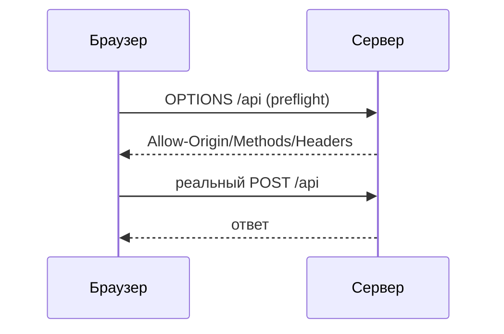

# CORS

CORS (Cross-Origin Resource Sharing) — механизм браузера, который решает,
можно ли странице с одного **origin** делать запросы к API на другом. Это
частый источник ошибок «запрос блокируется CORS-политикой».

## Что такое origin и Same-Origin Policy

**Origin** = схема + домен + порт (`https://app.example.com:443`). По умолчанию
браузер запрещает JavaScript читать ответы с **чужого** origin — это
**Same-Origin Policy**, защита от того, чтобы вредный сайт дёргал ваши API от
имени пользователя. CORS — это контролируемое ослабление этого запрета.

!!! warning "Это про браузер"
    CORS проверяет **браузер**, а не сервер. Из бэкенда, Postman или curl
    CORS нет вообще — ограничение существует только в JS в браузере.

## Как работает

Сервер разрешает чужой origin заголовками ответа:

- **`Access-Control-Allow-Origin: https://app.example.com`** — кому можно
  (или `*` для всех, но не вместе с куками).
- **`Access-Control-Allow-Methods`** — какие методы.
- **`Access-Control-Allow-Headers`** — какие заголовки.
- **`Access-Control-Allow-Credentials: true`** — можно ли слать куки.

## Preflight-запрос

Для «непростых» запросов (методы кроме GET/POST, кастомные заголовки, JSON)
браузер сначала шлёт **`OPTIONS`** — спрашивает разрешение, и только при
успехе делает основной запрос.

## Частая ошибка

«CORS не работает» обычно значит: сервер **не отдал** нужные
`Access-Control-Allow-*`. Лечится настройкой CORS на бэкенде/гейтвее (в Spring —
`@CrossOrigin` или глобальная `CorsConfiguration`), а не правкой фронтенда.

## Как ответить на интервью

Коротко: CORS — механизм браузера, ослабляющий Same-Origin Policy, которая по
умолчанию запрещает JS читать ответы с чужого origin (схема+домен+порт). Сервер
разрешает конкретный origin заголовком `Access-Control-Allow-Origin` и
методы/заголовки/куки соседними `Allow-*`. Для непростых запросов браузер
сначала шлёт preflight `OPTIONS`. Важно: это чисто браузерная штука — в curl
или между бэкендами CORS нет, а «ошибка CORS» почти всегда чинится на сервере,
а не на фронте.
