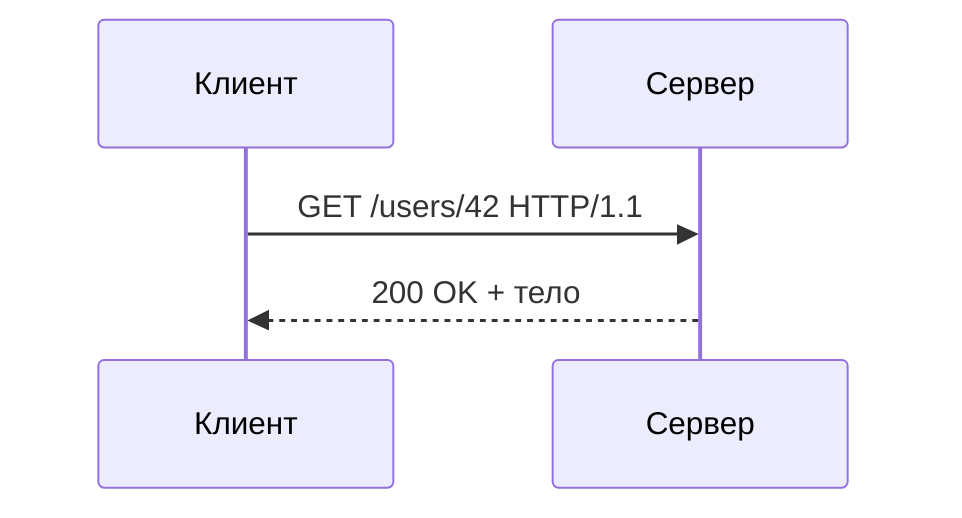

# Как работает HTTP

HTTP — текстовый протокол запрос-ответ поверх TCP (а в HTTP/3 — поверх QUIC/UDP).
Клиент шлёт **запрос**, сервер возвращает **ответ**. Протокол
**без состояния** (stateless): сервер не помнит предыдущие запросы, каждый
запрос самодостаточен.

## Модель запрос-ответ

Один цикл: клиент открывает соединение, отправляет запрос, получает ответ.

Запрос состоит из:

- **стартовой строки** — метод, путь, версия (`GET /users/42 HTTP/1.1`);
- **заголовков** — метаданные (`Host`, `Accept`, `Authorization`);
- **тела** (не всегда) — данные, например JSON при `POST`.

Ответ:

- **статусной строки** — версия, код, текст (`HTTP/1.1 200 OK`);
- **заголовков** (`Content-Type`, `Content-Length`);
- **тела** — сам ответ.

## Stateless и как обходят

Сервер не хранит контекст между запросами — это упрощает масштабирование
(любой инстанс обработает любой запрос). Чтобы «узнавать» пользователя между
запросами, состояние протаскивают явно: **куки/сессии**, **токены** в
заголовке `Authorization`.

## Версии протокола

- **HTTP/1.1** — текстовый, одно соединение = запросы по очереди. Чтобы не
  открывать TCP на каждый запрос, есть **keep-alive** (переиспользование
  соединения). Параллелизм — за счёт нескольких соединений.
- **HTTP/2** — бинарный, **мультиплексирование**: много запросов в одном
  соединении параллельно, без блокировки друг друга; сжатие заголовков.
- **HTTP/3** — поверх **QUIC (UDP)**: убирает head-of-line blocking на уровне
  TCP, быстрее устанавливает соединение.

## Как ответить на интервью

Коротко: HTTP — stateless протокол запрос-ответ поверх TCP. Запрос — это метод,
путь, заголовки и опционально тело; ответ — код статуса, заголовки и тело.
Без состояния: сервер не помнит прошлые запросы, поэтому легко масштабируется,
а «память» о пользователе протаскивают куками/сессией или токеном. HTTP/1.1
шлёт запросы по очереди (с keep-alive переиспользует TCP), HTTP/2 —
мультиплексирует их в одном бинарном соединении, HTTP/3 работает поверх QUIC
на UDP.
