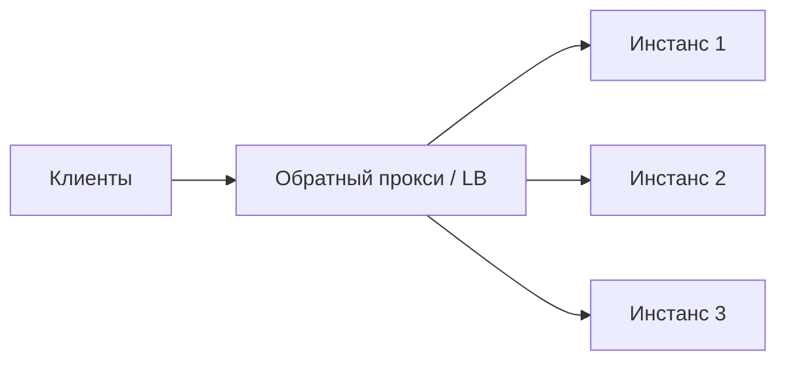

# Обратный прокси и балансировщик

Перед приложением почти всегда стоит **обратный прокси** — он принимает
запросы клиентов и перенаправляет их на бэкенды. **Балансировщик** — его
частая роль: распределять нагрузку между несколькими инстансами.

## Прямой и обратный прокси

- **Прямой прокси** — на стороне клиента, скрывает клиента от сервера
  (корпоративный прокси).
- **Обратный прокси** — на стороне сервера, скрывает бэкенды от клиента.
  Клиент видит один адрес, за ним — много сервисов/инстансов.

## Что делает обратный прокси

- **Балансировка нагрузки** между инстансами.
- **TLS termination** — расшифровка HTTPS в одном месте.
- **Кэширование** статики, сжатие ответов.
- **Маршрутизация** по пути/хосту к нужному сервису.
- **Защита** — rate limiting, фильтрация, скрытие внутренней топологии.

Типичные: **Nginx**, **HAProxy**, облачные LB; в микросервисах эту роль на
уровне приложения часто берёт **API Gateway** (например Spring Cloud Gateway).

## Алгоритмы балансировки

- **Round-robin** — по кругу.
- **Least connections** — на наименее загруженный инстанс.
- **По хэшу** (IP/ключа) — один клиент всегда на тот же инстанс (sticky).

## Health checks

Балансировщик периодически опрашивает инстансы (health-эндпоинт) и **выводит
из ротации** нездоровые, чтобы не слать трафик на упавший под. Это основа
отказоустойчивости за LB.

## Как ответить на интервью

Коротко: обратный прокси стоит перед бэкендами, принимает запросы и раздаёт их
инстансам. Он балансирует нагрузку (round-robin, least-connections, sticky по
хэшу), термирует TLS, кэширует и сжимает, маршрутизирует по пути/хосту и
защищает (rate limit). Через health checks выводит упавшие инстансы из
ротации — за счёт этого система переживает падение отдельных подов. Типичные —
Nginx, HAProxy, облачные LB; в микросервисах близкую роль играет API Gateway.
