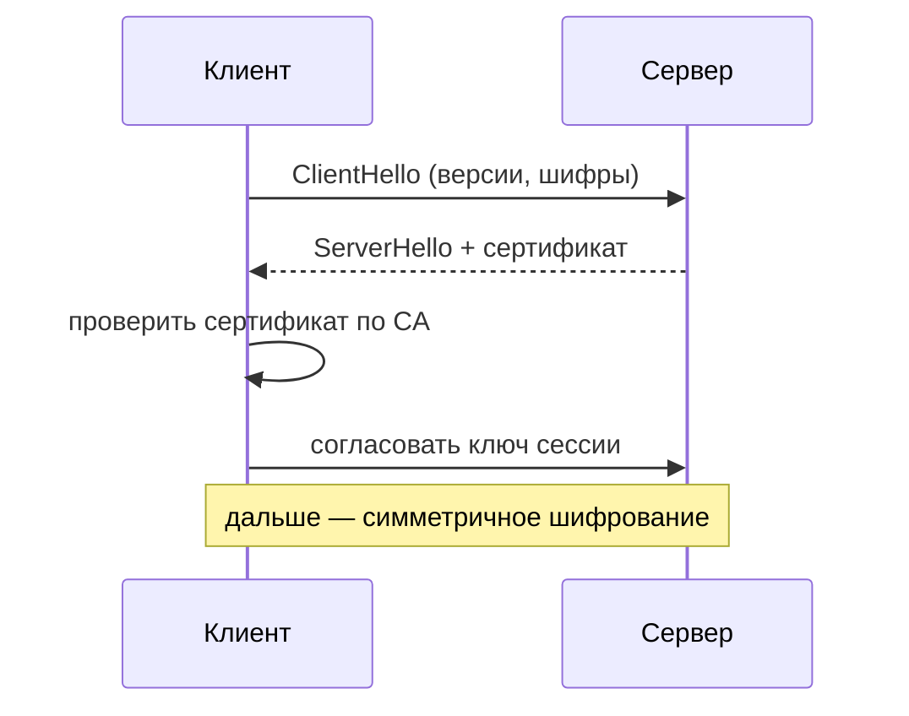

# TLS и HTTPS

HTTPS — это HTTP поверх **TLS**. TLS шифрует трафик, проверяет подлинность
сервера и защищает данные от подмены. Без него запрос идёт открытым текстом —
пароли и токены видны на пути.

## Что даёт TLS

- **Шифрование** — трафик нельзя прочитать по дороге.
- **Целостность** — нельзя незаметно подменить данные.
- **Аутентификация сервера** — по сертификату клиент убеждается, что это
  именно тот домен, а не подставной.

## Сертификаты и центры (CA)

Сервер предъявляет **сертификат** с публичным ключом, подписанный доверенным
**центром сертификации (CA)**. Браузер доверяет CA (список вшит в ОС/браузер) и
по цепочке доверия проверяет подпись. Так решается вопрос «откуда клиент знает,
что публичный ключ настоящий».

## Handshake (упрощённо)

Идея: асимметричной криптографией (медленной) стороны безопасно
**договариваются о симметричном ключе сессии**, а дальше весь трафик шифруют
быстрым симметричным шифром. В TLS 1.3 handshake короче и быстрее.

## Термирование TLS

Часто TLS «заканчивается» на балансировщике/обратном прокси (**TLS
termination**): он расшифровывает трафик, а до приложения внутри доверенной
сети идёт обычный HTTP. Так шифрование не грузит каждый сервис, а сертификаты
управляются в одном месте.

## Как ответить на интервью

Коротко: HTTPS — это HTTP поверх TLS, который даёт шифрование, целостность и
аутентификацию сервера. Сервер предъявляет сертификат, подписанный доверенным
центром (CA); браузер по цепочке доверия убеждается, что домен настоящий. В
handshake стороны асимметричной криптографией согласуют симметричный ключ
сессии, а дальше шифруют трафик им — быстро. На проде TLS часто термируют на
балансировщике, а внутри доверенной сети сервисы общаются по обычному HTTP.
